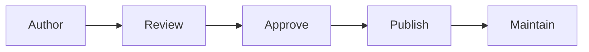
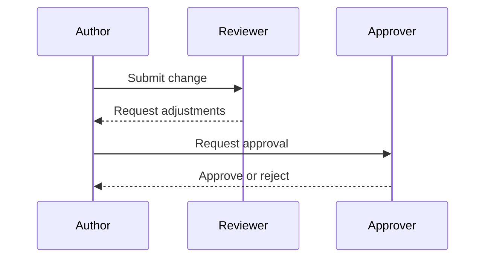

# Repository Standards

## Revision History

| Version | Date | Author | Summary |
| --- | --- | --- | --- |
| 1.0 | 2026-07-04 | Documentation Governance Architect | Initial enterprise governance standard for the IE Platform documentation repository |

## Table of Contents

1. Purpose
2. Scope
3. Repository Philosophy
4. Repository Structure
5. Folder Ownership
6. Document Numbering Standard
7. File Naming Convention
8. Markdown Standard
9. Metadata Standard
10. Directory Standards
11. README Standard
12. Diagram Standards
13. Image Standards
14. Template Usage
15. Version Control Standards
16. Review Process
17. Change Management
18. Repository Security
19. AI Usage Rules
20. Quality Checklist
21. Glossary
22. Appendix

## 1. Purpose

This document defines the official governance standard for the IE Platform documentation repository. It establishes the rules, responsibilities, structure, review process, and quality expectations required to maintain the repository as a durable, enterprise-grade source of truth.

This standard applies to software engineers, architects, technical writers, product managers, security reviewers, operations teams, and all AI-assisted development tools that interact with the repository.

## 2. Scope

This standard governs:

- Repository structure and organization
- Document numbering and naming
- Markdown authoring and metadata
- Diagram and image usage
- Review and approval workflows
- Version control and change management
- Security handling of repository content
- AI-assisted authoring and editing behavior

This standard does not redefine product architecture. It preserves the existing platform direction while enforcing a consistent repository operating model.

## 3. Repository Philosophy

The repository exists as a long-lived engineering asset. It must be:

- Accurate and current
- Consistent in structure and terminology
- Reviewable by technical and non-technical stakeholders
- Suitable for use by human engineers and AI systems alike
- Maintainable over the life of the IE Platform

The repository must not be treated as a temporary scratchpad. Every change must preserve clarity, traceability, and operating continuity.



## 4. Repository Structure

The repository structure is intentionally modular. Each top-level area has a distinct purpose.

| Path | Purpose |
| --- | --- |
| .github | Repository workflow assets, issue templates, and pull request templates |
| assets | Shared images, logos, icons, and diagrams |
| docs | Primary documentation content organized by domain |
| templates | Reusable document templates for architecture, product, API, UX, testing, and release work |
| .gitignore | Rules for files that must not be committed |

### Top-Level Documentation Areas

| Path | Responsibility |
| --- | --- |
| docs/00-governance | Repository policy, governance, ownership, and standards |
| docs/01-platform | Platform capabilities and service model |
| docs/02-architecture | Architecture principles, system views, and decision records |
| docs/03-database | Data architecture, schema guidance, and database standards |
| docs/04-api | API contracts, interface design, and versioning guidance |
| docs/05-design | UX and UI standards, screen specifications, and patterns |
| docs/06-products | Product requirements, product families, and product-specific documentation |
| docs/07-development | Software engineering practices and implementation standards |
| docs/08-security | Security policy, controls, and review expectations |
| docs/09-devops | Deployment, observability, and operations guidance |
| docs/10-testing | Quality strategy, validation, and testing standards |
| docs/11-ai | AI engineering foundation, standards, and roadmap |
| docs/12-white-label | White-label configuration and product extensibility standards |
| docs/13-integrations | Integration patterns and external connector guidance |
| docs/14-roadmap | Platform roadmap, milestones, and delivery planning |
| docs/15-decisions | Architecture and product decision records |
| docs/appendices | Glossaries, reference material, and supporting appendices |

## 5. Folder Ownership

Ownership is required for every domain area. A document owner must be named and accountable for quality, review, and changes.

| Folder | Primary Owner | Notes |
| --- | --- | --- |
| docs/00-governance | Documentation Guild | Repository standards and governance |
| docs/01-platform | Platform Engineering | Platform capabilities and platform operating model |
| docs/02-architecture | Solution Architecture | System architecture and design decisions |
| docs/03-database | Data Architecture | Data model and storage standards |
| docs/04-api | API Platform | API contracts and interface standards |
| docs/05-design | Design Systems | Visual and interaction design guidance |
| docs/06-products | Product Management | Product requirements and product-specific documentation |
| docs/07-development | Engineering Excellence | Engineering standards and implementation guidance |
| docs/08-security | Security Team | Security controls and review requirements |
| docs/09-devops | Platform Operations | Deployment and operational process documentation |
| docs/10-testing | Quality Engineering | Test strategies and quality standards |
| docs/11-ai | AI Engineering Lead | AI standards, prompts, and engineering guidance |
| docs/12-white-label | Product Strategy | White-label product configuration guidance |
| docs/13-integrations | Integration Engineering | Integration architecture and connector standards |
| docs/14-roadmap | Product Management | Planning and roadmap documents |
| docs/15-decisions | Architecture Review Board | Architectural and product decision records |
| docs/appendices | Documentation Guild | Reference material and glossary content |

## 6. Document Numbering Standard

Every document must carry a stable identifier that preserves traceability across the repository.

| Prefix | Purpose | Example |
| --- | --- | --- |
| IE-#### | Repository-wide enterprise documentation | IE-0001 |
| ADR-### | Architecture decision records | ADR-001 |
| API-### | API specification documents | API-001 |
| DB-### | Database documentation and schema definitions | DB-001 |
| SCR-### | Screen specifications and product experience specs | SCR-001 |
| TEST-### | Test cases and test definitions | TEST-001 |
| REL-### | Release notes | REL-001 |
| AI-### | AI engineering documents and artifacts | AI-001 |
| WL-### | White-label documents | WL-001 |

### Rules

- A document ID must be unique within the repository.
- Existing document IDs must not be reused for unrelated content.
- New documents must use the appropriate prefix and a sequential numeric value.
- The document ID must appear in the front matter and should remain stable across revisions.

## 7. File Naming Convention

File names must be clear, machine-friendly, and stable.

### Rules

- Use ASCII characters where possible.
- Replace Unicode dashes with standard hyphens.
- Use hyphens to separate words.
- Use descriptive and domain-specific names.
- Do not include spaces in file names.
- Keep file extensions lowercase.

### Allowed Characters

- Letters: A-Z, a-z
- Numbers: 0-9
- Hyphen: -
- Underscore: _

### Forbidden Characters

- Spaces
- Unicode punctuation such as em dash or en dash
- Special characters that may break links or tooling

### Examples

| Good | Bad |
| --- | --- |
| IE-0000A-Repository-Standards.md | IE-0000A Repository Standards.md |
| IE-0002-Part-01-Engineering-Handbook.md | IE-0002.1-Engineering-Handbook.md |
| API-001-Booking-Create.md | API-001 Booking Create.md |

### Extension Rules

- Markdown documents use the .md extension.
- Diagrams and assets should use standard extensions such as .svg, .png, .mermaid, or .drawio where appropriate.

## 8. Markdown Standard

Markdown is the primary authoring format for repository content.

### Heading Rules

- Use a single H1 per document.
- Use a logical heading hierarchy.
- Avoid skipping heading levels.

### Lists

- Use bullet lists for grouped items.
- Use numbered lists for procedural steps.
- Keep list items concise and parallel in structure.

### Tables

- Use tables for structured data and comparisons.
- Keep column names explicit and short.
- Prefer simple tables over dense multi-column layouts.

### Code Blocks

- Use fenced code blocks when examples are technical.
- Specify the language where possible.

### Admonitions and Callouts

Use admonitions sparingly and consistently for notes, warnings, or important guidance.

### Mermaid

Mermaid diagrams are required where structure, flow, lifecycle, or interactions benefit from visualization.



### YAML Front Matter

Every major document must include front matter with the required metadata fields.

```yaml
---
document_id: IE-0000A
title: Repository Standards
version: 1.0
status: Approved
owner: Indians Empire Technologies
review_date: 2026-07-04
last_updated: 2026-07-04
related_documents:
  - IE-0001
---
```

## 9. Metadata Standard

Every document must include the following metadata fields in front matter:

| Field | Requirement |
| --- | --- |
| document_id | Required and unique |
| title | Required and descriptive |
| version | Required and semver-like or numeric |
| status | Required, such as Draft, Active, Approved, Deprecated |
| owner | Required and explicit |
| review_date | Required and date-based |
| last_updated | Required and date-based |
| related_documents | Required and list-based |

Every document must also include a revision history table near the top of the document.

## 10. Directory Standards

Documents must be stored in the correct domain directory.

| Content Type | Directory |
| --- | --- |
| Governance and policy | docs/00-governance |
| Platform architecture | docs/01-platform |
| System architecture | docs/02-architecture |
| Database design | docs/03-database |
| API specifications | docs/04-api |
| UX and screen design | docs/05-design |
| Product requirements | docs/06-products |
| Engineering standards | docs/07-development |
| Security documents | docs/08-security |
| DevOps and operations | docs/09-devops |
| Testing documents | docs/10-testing |
| AI standards and prompts | docs/11-ai |
| White-label documents | docs/12-white-label |
| Integration documents | docs/13-integrations |
| Roadmaps and planning | docs/14-roadmap |
| Decision records | docs/15-decisions |
| Reference and glossary material | docs/appendices |

## 11. README Standard

Every folder that contains documentation must include a README file with the following sections:

- Purpose
- Contents
- Related Documents
- Navigation

The README must provide a clear entry point for the folder and link to neighboring documentation and the repository home.

## 12. Diagram Standards

Diagrams must help explain the system and should be consistent in style and naming.

### Supported Diagram Types

- Mermaid flow diagrams
- Mermaid sequence diagrams
- Mermaid ER diagrams
- Component diagrams
- Container diagrams
- Deployment diagrams

### Naming Rules

- Use descriptive names that indicate purpose.
- Use lower-case or kebab-case file names for assets.
- Keep diagram names consistent with the document they support.

### Consistency Rules

- Use consistent node naming.
- Keep layouts readable.
- Avoid overloading a single diagram with too many concepts.

## 13. Image Standards

Images should be stored in the appropriate assets folder and referenced consistently.

### File Types

- SVG for diagrams and vector illustrations when possible
- PNG for screenshots and raster images

### Naming Rules

- Use clear, descriptive names.
- Include context where needed.
- Avoid versionless names when content changes frequently.

### Location Rules

- Logos: assets/logos
- Icons: assets/icons
- Images: assets/images
- Diagrams: assets/diagrams

## 14. Template Usage

All new structured documents should use the repository templates wherever applicable.

| Template | Use Case |
| --- | --- |
| ADR | Architecture decision documentation |
| PRD | Product requirements documentation |
| FRS | Functional requirements documentation |
| DATABASE_TABLE | Data model and table definitions |
| API_SPEC | API contract documentation |
| SCREEN_SPEC | Screen or workflow specification |
| COMPONENT_SPEC | Reusable UI or service component definition |
| TEST_CASE | Validation and regression test cases |
| RELEASE_NOTE | Release and rollout documentation |

## 15. Version Control Standards

All repository changes must use Git with disciplined workflows.

### Git Rules

- Commit only purposeful changes.
- Keep change scope focused.
- Do not commit secrets, credentials, or generated artifacts unless explicitly approved.

### Commit Message Rules

Use concise, descriptive commit messages such as:

- docs: add repository governance standard
- docs: update architecture references
- feat(api): add booking endpoint documentation

### Branch Naming

Use branch names that describe the change clearly, such as:

- docs/repository-standards
- feat/booking-api
- fix/security-guidance

### Pull Requests

Every meaningful change must be submitted through a pull request with:

- A clear summary
- The reason for the change
- The impacted area
- The relevant review owner

### Code Reviews

Reviewers must validate correctness, clarity, security, and alignment with the existing standards.

## 16. Review Process

All documents follow a structured review pathway.

| Role | Responsibility |
| --- | --- |
| Author | Drafts content and ensures initial completeness |
| Reviewer | Checks accuracy, clarity, and consistency |
| Approver | Confirms that the document is ready for adoption |
| Release Owner | Publishes the document and updates index or changelog where relevant |

Documents must be reviewed when:

- The content changes materially
- Ownership changes
- The platform architecture changes
- Compliance, security, or operations requirements change

## 17. Change Management

Changes to repository content must be managed deliberately.

### Versioning

- Increment the version when substantive content changes are introduced.
- Preserve earlier versions where necessary for traceability.

### Deprecation

A document may be marked deprecated when it is superseded by a newer standard or architectural decision.

### Archive Process

Archived content should be retained in a controlled manner and clearly marked as historical material rather than current guidance.

## 18. Repository Security

Repository content must not include secrets, credentials, tokens, personal data, or internal-only information that should not be public.

### Mandatory Rules

- Never commit credentials or private keys.
- Never include personal data unless explicitly required and approved.
- Keep sensitive or confidential information out of repository content.
- Prefer references to approved internal systems over embedding protected material.

## 19. AI Usage Rules

AI tools are allowed to assist with repository work when they follow this governance standard.

### AI Tools Covered

- ChatGPT
- Codex
- GitHub Copilot
- Claude
- Gemini
- Cursor

### Rules AI Must Follow

- Preserve the existing architecture and repository structure.
- Do not invent facts or omit important context.
- Update documentation when behavior or design changes.
- Prefer explicit, documented decisions over assumptions.
- Keep outputs traceable and reviewable.
- Respect document ownership and review workflows.
- Use the repository templates and metadata format.

### Rules AI Must Never Violate

- Never remove or overwrite content without a justified reason.
- Never introduce unpublished architecture changes.
- Never commit secrets or credentials.
- Never bypass review and approval requirements.
- Never claim verification without evidence.

## 20. Quality Checklist

The repository is considered healthy when the following conditions are met.

### Repository Checklist

- [ ] The repository structure remains consistent.
- [ ] README files exist in the relevant folders.
- [ ] Navigation and links resolve correctly.
- [ ] The changelog and index remain current.
- [ ] No secrets or credentials are committed.

### Document Checklist

- [ ] The document has front matter.
- [ ] The document has a unique ID.
- [ ] The document includes revision history.
- [ ] The document is owned by a named party.
- [ ] The document is linked from relevant indexes or README files.

### Markdown Checklist

- [ ] Headings are used correctly.
- [ ] Tables and diagrams are used where useful.
- [ ] Links are valid and purposeful.
- [ ] The content is concise and accurate.

### Architecture Checklist

- [ ] The content preserves the intended platform boundaries.
- [ ] The material is consistent with the IE Platform architecture.
- [ ] Product and technical decisions are documented clearly.

### AI Checklist

- [ ] AI-generated changes follow repository standards.
- [ ] AI-generated changes preserve existing content.
- [ ] AI-generated changes are reviewable and traceable.

## 21. Glossary

| Term | Definition |
| --- | --- |
| Repository | The documentation and standards source of truth for the IE Platform |
| Governance | The set of rules and responsibilities that guide repository maintenance |
| Review | The process of validating quality, correctness, and alignment |
| Approval | Formal recognition that a document or change is acceptable for use |
| Ownership | The accountable party for the quality and currency of a document |

## 22. Appendix

### Appendix A: Minimum Required Document Structure

Every new document should include:

1. Front matter
2. Title and summary
3. Revision history
4. Table of contents when the document is lengthy
5. Main content
6. Related references
7. Glossary where useful

### Appendix B: Reference Documents

- [IE Platform Documentation Repository](../../README.md)
- [Governance](README.md)
- [AI System Prompt](../11-ai/AI_SYSTEM_PROMPT.md)
- [AI Documentation Standard](../11-ai/AI_DOCUMENTATION_STANDARD.md)
- [Project Roadmap](../11-ai/PROJECT_ROADMAP.md)
