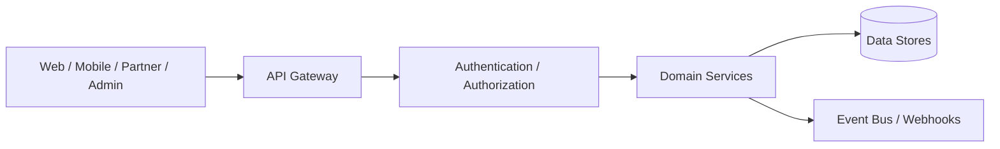

# API Architecture Blueprint

## Revision History

| Version | Date | Author | Summary |
| --- | --- | --- | --- |
| 1.0 | 2026-07-04 | Solution Architecture Group | Initial API architecture blueprint for IE Platform product and platform services |

## Table of Contents

1. Purpose
2. Scope
3. Architectural Principles
4. API Platform Architecture
5. REST Standards
6. Endpoint Structure
7. Authentication and Authorization
8. Versioning Strategy
9. Error Handling
10. Pagination, Filtering, and Sorting
11. Request and Response Format
12. OpenAPI Strategy
13. Security Controls
14. Rate Limiting and Throttling
15. Webhooks
16. Future GraphQL Strategy
17. Operational Expectations

## 1. Purpose

This document defines the API architecture blueprint for the IE Platform. It establishes how internal and external APIs are designed, documented, protected, and evolved so that the platform can scale across web, mobile, business operations, and future white-label experiences without creating incompatible interfaces.

The API architecture is intended to support AppointIE, business dashboards, BI reporting, admin tools, third-party integrations, and future platform extensions.

## 2. Scope

This blueprint covers:

- RESTful platform and product APIs
- Service-to-service APIs
- Public and partner-facing APIs
- Authentication, authorization, and security controls
- Versioning, change management, and compatibility rules
- Documentation and contract governance

It does not replace domain-specific API contracts. Instead, it provides the architectural rules that those contracts must follow.

## 3. Architectural Principles

The API platform must be:

- Consistent across services
- Secure by default
- Observable and debuggable
- Version-tolerant
- Designed for long-term compatibility
- Suitable for both human and machine clients

The foundational model is a layered API architecture:



## 4. API Platform Architecture

The platform will expose APIs through a managed entry layer that performs routing, authentication, throttling, logging, monitoring, and request validation before traffic reaches service-specific implementations.

### Core Components

- API Gateway: central request entry point and routing layer
- Identity and Access Layer: token validation, role checks, and session handling
- Domain Services: business capability endpoints such as booking, customer management, analytics, and admin operations
- Event Layer: asynchronous integration and notification channels
- Observability Layer: tracing, logging, metrics, and alerting

### Interface Boundaries

- Customer-facing APIs: used by web, mobile, and partner applications
- Internal APIs: consumed by platform services and internal tooling
- Admin APIs: used by operations and platform administration interfaces
- Integration APIs: used by external systems and third-party partners

## 5. REST Standards

REST APIs will be designed around resource-oriented semantics and standard HTTP methods.

### Resource Naming

- Use lowercase plural nouns for resource collections.
- Use nested resources only when the relationship is truly hierarchical.
- Avoid verbs in path segments.

### Examples

- GET /v1/customers
- GET /v1/customers/123
- POST /v1/bookings
- PATCH /v1/bookings/456
- DELETE /v1/appointments/789

### Method Semantics

| Method | Use |
| --- | --- |
| GET | Read-only retrieval |
| POST | Create new resource or trigger action |
| PATCH | Partial update |
| PUT | Full replace when appropriate |
| DELETE | Remove resource |

### Status Code Rules

- 200: successful retrieval or update
- 201: resource created
- 202: accepted for asynchronous processing
- 204: deletion completed with no body
- 400: malformed request
- 401: authentication required
- 403: authorization denied
- 404: resource not found
- 409: conflict with current state
- 422: validation error
- 429: rate limit exceeded
- 500: unexpected server error

## 6. Endpoint Structure

Endpoints must be predictable and versioned at the path level.

### URI Convention

- Base path: /v1/ for stable major versions
- Segment pattern: /resource or /resource/{id}
- Sub-resources: /resource/{id}/subresource
- Action endpoints: use POST only when the operation is not a conventional CRUD action

### Recommended Patterns

- Collection endpoints for lists
- Detail endpoints for single resources
- Action endpoints for workflows such as approve, cancel, resend, or export
- Filtered query endpoints using query parameters rather than path overloads

### Example Endpoint Groups

- /v1/customers
- /v1/bookings
- /v1/services
- /v1/staff
- /v1/analytics/reports
- /v1/admin/users

## 7. Authentication and Authorization

Authentication and authorization must be enforced consistently across all APIs.

### Authentication Methods

- OAuth 2.0 / OpenID Connect for user-facing and partner-facing APIs
- Service-to-service tokens for internal communication
- Short-lived access tokens with refresh support

### Authorization Model

The platform should support:

- Role-based access control for business and platform roles
- Resource-level permissions for sensitive actions
- Tenant-level scoping for white-label deployments
- Auditability for privileged operations

### Security Headers

Every API response should include appropriate security headers such as:

- Cache-Control
- Content-Security-Policy where applicable
- X-Content-Type-Options
- Referrer-Policy
- Strict-Transport-Security

## 8. Versioning Strategy

The platform will use URI versioning for public and shared APIs.

### Rules

- Major versions use /v1, /v2, and so on.
- Backward-incompatible changes require a new major version.
- Minor changes should be additive and backward-compatible.
- Deprecations must be announced in advance and documented in release notes.

### Compatibility Policy

- Existing clients must continue operating during a deprecation window.
- Deprecated fields should remain available until the end of the support window.
- Breaking changes must be explicitly approved and documented.

## 9. Error Handling

Error responses must be consistent, actionable, and machine-readable.

### Error Envelope

```json
{
  "error": {
    "code": "VALIDATION_FAILED",
    "message": "One or more request fields are invalid.",
    "details": [
      {
        "field": "email",
        "issue": "must be a valid email address"
      }
    ]
  }
}
```

### Rules

- Never expose internal stack traces to clients.
- Provide a stable error code and human-readable message.
- Include field-level detail when validation fails.
- Use 4xx for client issues and 5xx for server-side failures.

## 10. Pagination, Filtering, and Sorting

Collection endpoints must support consistent pagination and query semantics.

### Pagination

Use cursor-based pagination for large or dynamic datasets, and offset pagination only where a simple index is acceptable.

### Filtering

Support query parameters for common filters:

- status
- created_after
- created_before
- owner_id
- tenant_id
- category

### Sorting

Allow sort order through query parameters such as:

- sort=created_at:desc
- sort=total:asc

## 11. Request and Response Format

The platform will use JSON as the default payload format for all REST APIs.

### Request Format

- UTF-8 encoded JSON payloads
- Consistent field naming using snake_case or camelCase based on service convention
- Explicit validation of required fields
- Content-Type: application/json

### Response Format

```json
{
  "data": {
    "id": "cust_123",
    "name": "Ava Patel",
    "status": "active"
  },
  "meta": {
    "request_id": "req_789",
    "timestamp": "2026-07-04T00:00:00Z"
  }
}
```

### Collection Response Format

```json
{
  "data": [
    {
      "id": "cust_123",
      "name": "Ava Patel"
    }
  ],
  "meta": {
    "page": 1,
    "page_size": 25,
    "has_next": true
  }
}
```

## 12. OpenAPI Strategy

All public and shared internal APIs must be described with OpenAPI documents.

### Requirements

- Each API must have an OpenAPI 3.1 contract.
- Schemas must be versioned with the API.
- Example payloads must be included for major request and response shapes.
- Authentication flows must be documented.
- Error responses must be enumerated.

### Documentation Workflow

1. Define the contract before implementation.
2. Review the contract with platform and product stakeholders.
3. Generate documentation from the contract.
4. Treat the contract as the source of truth for client integration.

## 13. Security Controls

API security must be layered and explicit.

### Controls

- TLS everywhere
- Token-based authentication
- Authorization checks at the service boundary
- Input validation and schema enforcement
- Structured logging without sensitive data exposure
- Audit trails for privileged operations

### Data Handling

- Never log raw secrets or tokens.
- Redact PII in logs and traces.
- Apply tenant and role isolation in all business service calls.

## 14. Rate Limiting and Throttling

Public and shared APIs must be protected from abuse.

### Strategy

- Apply per-tenant and per-user rate limits.
- Differentiate between anonymous, authenticated, and partner clients.
- Return clear 429 responses with retry guidance.
- Support burst tolerance with smoothing policies.

### Example Policy

- Anonymous: 60 requests/minute
- Authenticated users: 600 requests/minute
- Partner integrations: 3000 requests/minute

## 15. Webhooks

Asynchronous integrations should be event-driven where the business case justifies it.

### Webhook Rules

- Webhook events must be signed.
- Delivery retries must be supported.
- Event payloads must be versioned.
- Idempotency keys must be included where feasible.

### Event Examples

- booking.created
- booking.updated
- appointment.cancelled
- payment.confirmed
- customer.deleted

## 16. Future GraphQL Strategy

GraphQL may be introduced in the future for complex multi-resource experiences, especially analytics, BI dashboards, and tightly coupled mobile experiences.

### Guidance

- GraphQL should be exposed only where the data access pattern is highly dynamic.
- REST remains the default for simple CRUD operations and partner contracts.
- GraphQL schemas should be governed by the same security, versioning, and documentation rules as REST.
- Avoid introducing GraphQL for simple screen-level data retrieval when REST is sufficient.

## 17. Operational Expectations

Every API must be observable and support safe change.

### Operational Requirements

- Health and readiness endpoints
- Structured metrics and latency tracking
- Request correlation IDs
- Alerting for error rates and saturation
- Version deprecation planning
- Canary or staged release support where necessary

## Related Documents

- [API Design](README.md)
- [Architecture](../02-architecture/README.md)
- [Database Design](../03-database/README.md)
- [Design System](../05-design/README.md)
