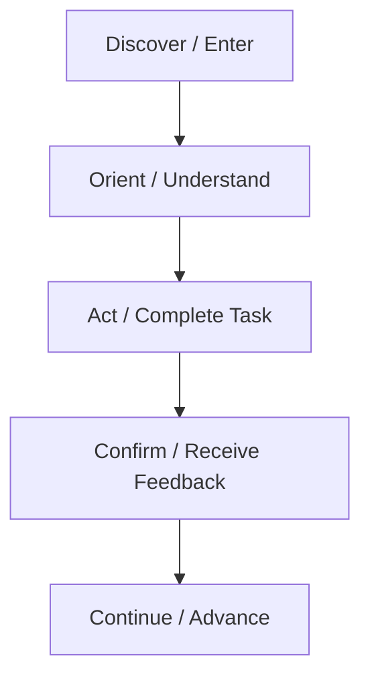

# UI/UX Architecture Blueprint

## Revision History

| Version | Date | Author | Summary |
| --- | --- | --- | --- |
| 1.0 | 2026-07-04 | Design Systems Group | Initial UI and UX architecture blueprint for the IE Platform |

## Table of Contents

1. Purpose
2. Experience Architecture Principles
3. Product Experience Model
4. Responsive Strategy
5. Navigation Model
6. Layout and Grid System
7. Accessibility System
8. Theme and Mode Strategy
9. Design Tokens
10. Spacing and Typography
11. Color and Iconography
12. Motion and Feedback
13. State Design Patterns
14. Content and Information Hierarchy
15. Design Governance

## 1. Purpose

This document defines the UI and UX architecture for the IE Platform. It establishes the interaction model, layout system, accessibility requirements, visual language, and experience conventions that will govern all product surfaces, including web, mobile, dashboard, and administration experiences.

The blueprint is intended to support AppointIE, business operations, BI reporting, customer engagement, platform administration, and future white-label extensions without re-creating UI patterns for each product.

## 2. Experience Architecture Principles

The platform experience must be:

- Clear and task-focused
- Consistent across devices and roles
- Accessible to diverse users and assistive technologies
- Fast and responsive under real-world conditions
- Trustworthy in both transactional and analytic contexts

### Core Intent

The experience should reduce cognitive load by making the next best action obvious, presenting information in the right context, and preserving continuity across journeys.

## 3. Product Experience Model

The IE Platform experiences are divided into four primary product modes:

| Mode | Primary Users | Primary Objectives |
| --- | --- | --- |
| Customer App | End customers and booking users | Discover services, book, manage, receive notifications |
| Business Dashboard | Service providers and business operators | Manage bookings, customers, services, staff, and business operations |
| BI Dashboard | Managers, analysts, and executives | Understand performance, revenue, attendance, trends, and health |
| Platform Admin | Internal operators and administrators | Configure platform, manage accounts, monitor security, and support operations |

Each mode uses the same design foundation but adapts information hierarchy, density, and controls to the user’s role and context.

## 4. Responsive Strategy

The platform must be designed using a mobile-first and web-first strategy that preserves coherence across breakpoints.

### Mobile-First Principles

- Prioritize core tasks and essential content first.
- Keep navigation compact and predictable.
- Reduce cognitive strain with progressive disclosure.
- Support thumb-friendly interaction zones.

### Web-First Principles

- Expand information density with larger layouts and multi-panel views.
- Support keyboard navigation and advanced workflows.
- Display analytics, admin controls, and management data with clarity.

### Breakpoint Strategy

| Device | Layout Approach |
| --- | --- |
| Mobile | Single-column and stacked panels |
| Tablet | Two-column content and flexible side panels |
| Desktop | Multi-panel layouts, dense management surfaces, and analytics views |

## 5. Navigation Model

Navigation must be role-driven, predictable, and support both short and long journeys.

### Navigation Principles

- One primary path for each core task
- Persistent context for users who shift between tasks
- Clear hierarchy for top-level, secondary, and tertiary actions
- Minimal hidden behavior that depends on memory

### Navigation Structure

- Global navigation for core product modes
- Local navigation for domain-specific modules
- Contextual actions for task-focused operations
- Deep-linkable routes for shared states and workflows

### Recommended Navigation Pattern

- Home or Overview
- Bookings or Services
- Customers and Staff
- Analytics and Reports
- Notifications
- Settings and Profile

## 6. Layout and Grid System

The layout system is built around an 8-point rhythm and responsive grid rules.

### Grid Rules

- Mobile: 4-column grid
- Tablet: 8-column grid
- Desktop: 12-column grid
- Use consistent spacing and alignment across modules

### Layout Patterns

- Dashboard cards for overview
- Detail pages for focused tasks
- Split layouts for comparison and management
- Full-width layouts for content-heavy operations

## 7. Accessibility System

Accessibility is a product requirement, not an enhancement.

### Accessibility Standards

- WCAG 2.2 AA minimum conformance
- Full keyboard support for all interactive states
- Sufficient color contrast for text and interface elements
- Focus visibility and logical tab order
- Screen-reader-friendly labels and announcements
- Touch target sizes of at least 44x44px

### Accessibility Design Requirements

- Do not depend on color alone to communicate state
- Use semantic structures for headings, forms, tables, and navigation
- Provide accessible names for icons and controls
- Support reduced motion preferences

## 8. Theme and Mode Strategy

The platform must support light and dark modes without reducing clarity or usability.

### Light Mode

- High contrast for readability
- Clean surfaces for long-form content and dashboards
- Suitable for daytime and high-focus workflows

### Dark Mode

- Reduced luminance for extended sessions
- Preserved contrast and semantic color roles
- Appropriate for evening use and low-light environments

### Mode Rules

- Both themes must preserve the same structure and information hierarchy.
- The mode switch must be discoverable but not intrusive.
- Semantic colors must remain consistent across modes.

## 9. Design Tokens

Design tokens provide the single source of truth for visual decisions.

### Token Categories

| Category | Examples |
| --- | --- |
| Color | primary, success, warning, danger, neutral |
| Typography | display, heading, body, caption, button |
| Spacing | 4, 8, 12, 16, 24, 32, 40, 48, 64 |
| Radius | sm, md, lg, xl |
| Elevation | surface-default, surface-overlay, focus-ring |
| Motion | fast, normal, slow |

### Token Governance

Tokens must be defined once and reused instead of repeatedly re-creating equivalent values in component code or Figma files.

## 10. Spacing and Typography

### Spacing

The spacing system uses an 8-point rhythm. Core spacing values include 4, 8, 12, 16, 24, 32, 40, 48, and 64.

### Typography

The system should use a modern, highly legible sans-serif type family with a clear hierarchy for display, headings, body, caption, and button text.

| Role | Usage |
| --- | --- |
| Display | Hero headers and marketing contexts |
| Heading | Page titles and section titles |
| Body | Primary content |
| Caption | Helper text and metadata |
| Button | Primary action labels |

## 11. Color and Iconography

### Color Usage

Color is semantically assigned rather than purely decorative.

- Primary: core brand or product action
- Success: completion and approval
- Warning: caution and attention
- Error: failure and destructive action
- Info: neutral information update
- Neutral: interface surfaces and text

### Iconography

Icons must be simple, consistent, and recognizable. They should support meaning without introducing ambiguity.

## 12. Motion and Feedback

Motion should reinforce status, transition, and hierarchy without distracting the user.

### Motion Principles

- Use motion to guide attention, not to entertain.
- Keep transitions short and predictable.
- Preserve continuity during state changes.

### Feedback Patterns

- Loading states for asynchronous work
- Empty states for no-data conditions
- Error states to explain failure clearly
- Success states to confirm completion

## 13. State Design Patterns

Every interactive surface should support explicit states:

- Default
- Hover
- Focus
- Active
- Disabled
- Loading
- Error
- Success

These states must be designed and implemented consistently across web and mobile surfaces.

## 14. Content and Information Hierarchy

The experience should prioritize the information that matters most for the current task.

### Content Hierarchy Rules

- Put primary actions before secondary actions.
- Group related controls and information.
- Use progressive disclosure to manage complexity.
- Preserve user context across multi-step workflows.

## 15. Design Governance

The design system must be governed through shared documentation, reviewed patterns, and reusable components.

### Governance Requirements

- Every pattern must be documented.
- New components require design review before broad adoption.
- Accessibility review is mandatory for any new or modified interaction pattern.
- White-label themes must preserve the core interaction language while allowing brand expression.

## Related Documents

- [Design Language and Brand Standards](IE-0003A-Design-Language-and-Brand-Standards.md)
- [Shared Component Library Standard](IE-0003B-Shared-Component-Library-Standard.md)
- [API Architecture Blueprint](../04-api/IE-0007-API-Architecture-Blueprint.md)
