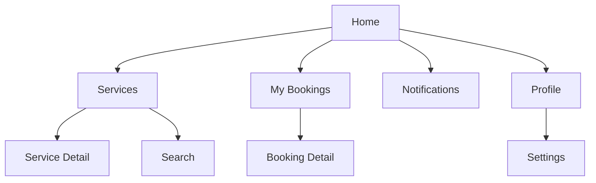
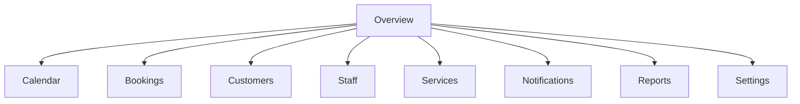
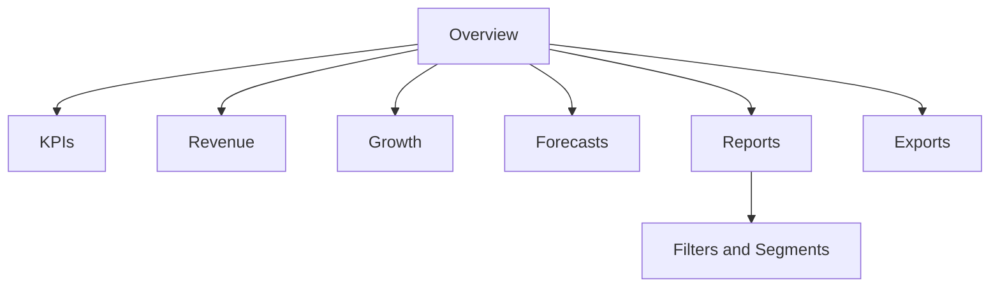
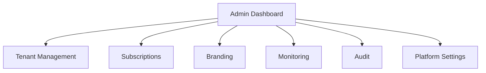
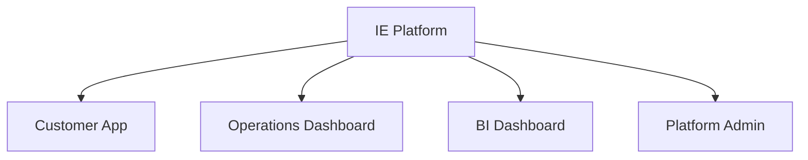

# Information Architecture

## Revision History

| Version | Date | Author | Summary |
| --- | --- | --- | --- |
| 1.0 | 2026-07-04 | Design Systems Group | Initial information architecture for the IE Platform experience |

## Table of Contents

1. Purpose
2. IA Objectives
3. Content Model
4. Customer App Sitemap
5. Operations Dashboard Sitemap
6. Business Intelligence Dashboard Sitemap
7. Platform Admin Sitemap
8. Relationships and Hierarchy
9. Navigation Model
10. Content Organization Principles
11. Mermaid Diagrams
12. Glossary
13. Appendix

## 1. Purpose

This document defines the content structure and information hierarchy for the IE Platform. It provides a shared architectural framework for how users discover content, complete tasks, and move between product surfaces across customer, operations, analytics, and administration experiences.

## 2. IA Objectives

The information architecture must:

- Reduce cognitive load for primary tasks
- Support the product requirements and functional specifications for AppointIE
- Preserve a consistent structure across white-label deployments
- Allow clear navigation between core domains and supporting surfaces

## 3. Content Model

The platform content is organized into four primary domains:

| Domain | Primary User | Main Goals |
| --- | --- | --- |
| Customer App | Customer | Discover services, book, manage appointments, receive updates |
| Operations Dashboard | Business Owner / Staff | Manage bookings, services, schedules, customers, notifications |
| BI Dashboard | Managers / Analysts | Review KPIs, revenue, growth, forecasts, and reports |
| Platform Admin | Platform Operator | Manage tenants, subscriptions, branding, monitoring, and audit |

## 4. Customer App Sitemap

### Customer App Content Groups

- Authentication and account access
- Discover and browse services
- Booking and appointment management
- Notifications and reminders
- Profile and account settings

## 5. Operations Dashboard Sitemap

### Operations Dashboard Content Groups

- Daily operations overview
- Schedule and calendar management
- Booking operations
- Customer management
- Staff and service management
- Business notifications and reminders
- Reporting and operational insights

## 6. Business Intelligence Dashboard Sitemap

### BI Dashboard Content Groups

- KPI summaries
- Revenue trend analysis
- Growth and attendance reporting
- Forecasts and planning views
- Report generation and export workflows

## 7. Platform Admin Sitemap

### Platform Admin Content Groups

- Platform control center
- Business onboarding and tenant administration
- Subscription management
- White-label branding and configuration
- Monitoring, audit, and support workflows

## 8. Relationships and Hierarchy

The information architecture uses a layered hierarchy:

| Level | Purpose |
| --- | --- |
| Domain | Distinguishes major product experiences |
| Module | Groups related tasks and information |
| Page or Screen | Supports a specific interaction goal |
| Component | Displays content within a page or workflow |

### Relationships

- Customer flows are anchored in booking and account management.
- Business flows are anchored in day-to-day operations and scheduling.
- BI flows are anchored in analytical review and reporting.
- Admin flows are anchored in platform governance and scale operations.

## 9. Navigation Model

The navigation model should follow the user’s mental model and the business objective of the current task.

### Navigation Rules

- Global navigation should support switching between product domains.
- Module navigation should support movement between related tasks.
- Contextual navigation should support action-oriented tasks such as booking, editing, or reviewing.
- Deep links should preserve state when users return later.

## 10. Content Organization Principles

- Organize content by task rather than by internal system structure.
- Group things that are used together.
- Keep frequently used actions visible and reachable.
- Separate administrative and operational content from consumer-facing content.
- Preserve consistent terminology across modules and brands.

## Mermaid Diagrams

## Glossary

| Term | Definition |
| --- | --- |
| Information Architecture | The structural organization of content and navigation within a product |
| Sitemap | A representation of the relationships between major product surfaces |
| Module | A cluster of related screens or tasks within a domain |

## Appendix

### Related References

- [UX Principles](IE-0008.02-UX-Principles.md)
- [Navigation Architecture](IE-0008.04-Navigation-Architecture.md)
- [Screen Inventory](IE-0008.11-Screen-Inventory.md)
