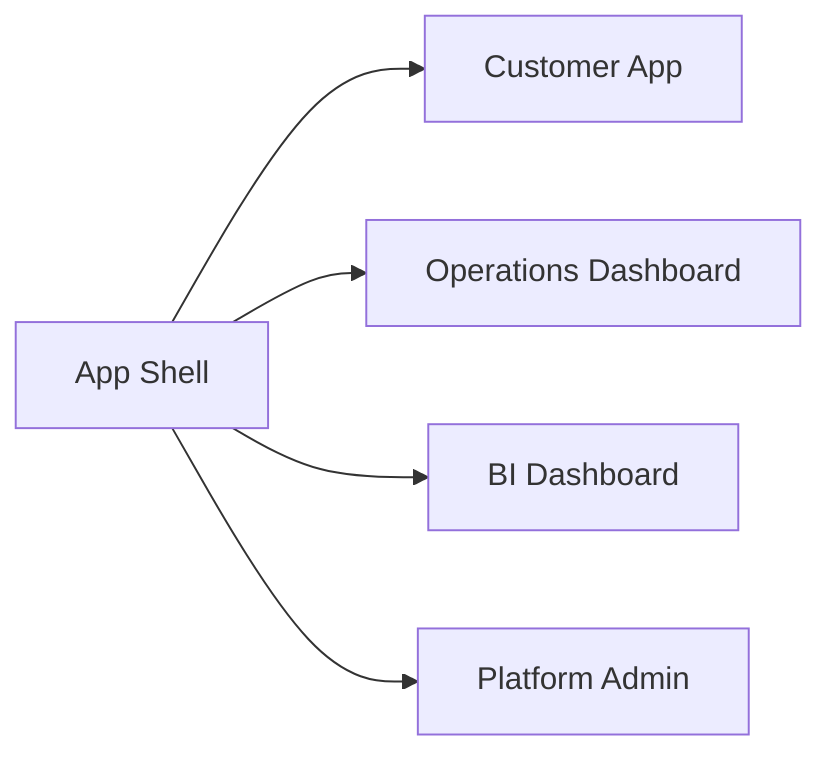

# Navigation Architecture

## Revision History

| Version | Date | Author | Summary |
| --- | --- | --- | --- |
| 1.0 | 2026-07-04 | Design Systems Group | Initial navigation architecture for the IE Platform experience |

## Table of Contents

1. Purpose
2. Navigation Principles
3. Global Navigation
4. Bottom Navigation
5. Side Navigation
6. Dashboard Navigation
7. Breadcrumbs
8. Deep Linking
9. Navigation Rules
10. Navigation States
11. Future Expansion
12. Glossary
13. Appendix

## 1. Purpose

This document defines the navigation architecture for the IE Platform. It specifies how users move between product domains, task modules, and individual screens across mobile, web, and administration surfaces.

## 2. Navigation Principles

- Navigation should support clear task completion.
- The primary journey should be reachable in a minimal number of steps.
- Navigation should remain consistent across customer, operations, analytics, and admin experiences.
- Users should always know where they are and how to return to a previous state.

## 3. Global Navigation

Global navigation provides cross-domain access and is used to transition between primary product modes.

| Product Mode | Navigation Entry |
| --- | --- |
| Customer App | Home, Bookings, Notifications, Profile |
| Operations Dashboard | Overview, Calendar, Bookings, Customers, Reports |
| BI Dashboard | Overview, Revenue, Growth, Forecasts, Reports |
| Platform Admin | Dashboard, Tenants, Subscriptions, Branding, Monitoring |

## 4. Bottom Navigation

Bottom navigation is reserved for the customer mobile experience and other compact, touch-first surfaces.

| Item | Purpose |
| --- | --- |
| Home | Discover and overview |
| Services | Browse and search services |
| Bookings | Review and manage appointments |
| Notifications | Review reminders and updates |
| Profile | Account settings and profile actions |

### Bottom Navigation Rules

- Keep the primary destinations limited to five items.
- Preserve consistent active and selected states.
- Ensure that the current location is always visible.

## 5. Side Navigation

Side navigation is used for business dashboards and admin surfaces where dense information and multi-step tasks are common.

### Side Navigation Modules

- Overview
- Calendar
- Bookings
- Customers
- Staff
- Services
- Reports
- Settings

### Side Navigation Rules

- Group related tasks together.
- Keep the current section visually distinct.
- Use clear labels and avoid nested complexity where possible.

## 6. Dashboard Navigation

Dashboard navigation is used for overview and analytics surfaces where users need quick movement between summary views and detail views.

### Patterns

- Summary cards leading to detail views
- Drill-down from KPIs to reports
- Filter-based navigation to segmented data views

## 7. Breadcrumbs

Breadcrumbs are used to support orientation in deeper module structures, especially in settings, admin, reports, and multi-step management flows.

### Rules

- Show the current location within a hierarchy.
- Keep breadcrumb labels short and meaningful.
- Do not use breadcrumbs for primary task flows when a simpler local path is sufficient.

## 8. Deep Linking

The system should support deep linking into core flows such as booking, confirmation, report views, and admin screens.

### Requirements

- Each deep-linked route must preserve context.
- Shared states should be recoverable after refresh or return.
- The route should remain stable across version changes where possible.

## 9. Navigation Rules

1. Each screen must have a clear parent and purpose.
2. The primary action should remain visible and predictable.
3. Navigation should support both novice and expert users.
4. Users should always be able to return to the prior context.
5. Complex workflows should use step-based navigation where appropriate.

## 10. Navigation States

| State | Requirement |
| --- | --- |
| Default | Show the active destination clearly |
| Hover | Highlight interactive navigation items |
| Active | Indicate the current location |
| Focus | Preserve keyboard accessibility |
| Disabled | Communicate non-available options clearly |

## 11. Future Expansion

The navigation architecture must be extensible for future modules such as payments, inventory, CRM, support, marketing, and additional white-label products. It should be possible to add new modules without destabilizing the existing navigation model.

## Glossary

| Term | Definition |
| --- | --- |
| Deep link | A direct route to a specific screen or workflow state |
| Global navigation | The primary high-level movement between product domains |
| Module navigation | Navigation within a focused workflow or domain |

## Appendix

### Related References

- [Information Architecture](IE-0008.03-Information-Architecture.md)
- [Customer App UX](IE-0008.05-Customer-App-UX.md)
- [Operations Dashboard UX](IE-0008.06-Operations-Dashboard-UX.md)
