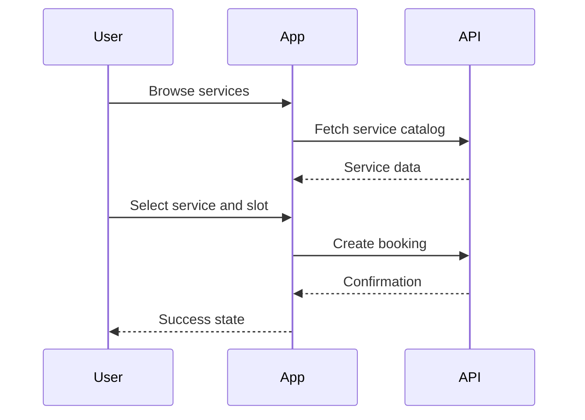

# Customer App UX

## Revision History

| Version | Date | Author | Summary |
| --- | --- | --- | --- |
| 1.0 | 2026-07-04 | Design Systems Group | Initial customer app UX specification aligned to AppointIE functional requirements |

## Table of Contents

1. Purpose
2. Customer Experience Goals
3. Core User Journeys
4. Screen Inventory
5. Screen Specifications
6. Interaction Patterns
7. Validation and Edge Cases
8. Accessibility Requirements
9. Glossary
10. Appendix

## 1. Purpose

This document defines the customer-facing experience for the AppointIE mobile application. It covers the primary screens, behaviours, interactions, validation rules, and accessibility expectations required to support the customer booking and account management experience.

## 2. Customer Experience Goals

The customer experience should support:

- Fast discovery of services
- Reliable booking completion
- Clear appointment management
- Timely notifications
- Simple profile and settings control

## 3. Core User Journeys

| Journey | Primary Goal | Key Screens |
| --- | --- | --- |
| Sign up | Create an account | Welcome, Sign Up, OTP Verification |
| Login | Access the account | Login, Forgot Password |
| Browse services | Discover relevant offers | Home, Categories, Service List |
| Book appointment | Secure a time slot | Service Detail, Staff Selection, Date Selection, Time Selection, Review, Confirmation |
| Manage booking | Change or cancel an appointment | My Bookings, Booking Detail |
| Profile management | Maintain account preferences | Profile, Settings, Notification Settings |

## 4. Screen Inventory

| Screen ID | Screen | Purpose |
| --- | --- | --- |
| APP-001 | Splash | Brand and loading entry state |
| APP-002 | Onboarding | Introduce product value and permissions |
| APP-003 | Login | Authenticate existing users |
| APP-004 | Register | Create a new account |
| APP-005 | OTP Verification | Confirm registration or reset flow |
| APP-006 | Forgot Password | Recover access |
| APP-007 | Home | Overview and discovery |
| APP-008 | Categories | Browse services by category |
| APP-009 | Service List | Review services for a category or search |
| APP-010 | Service Detail | Understand a service and its requirements |
| APP-011 | Staff Selection | Choose a preferred staff member |
| APP-012 | Date Selection | Pick a date |
| APP-013 | Time Slot Selection | Pick an available slot |
| APP-014 | Review Booking | Confirm booking details |
| APP-015 | Booking Confirmation | Show success and next steps |
| APP-016 | My Bookings | Review upcoming and past appointments |
| APP-017 | Booking Detail | Review and edit an existing booking |
| APP-018 | Notifications | Review reminders and system messages |
| APP-019 | Profile | View account summary |
| APP-020 | Settings | Configure notifications and account preferences |

## 5. Screen Specifications

### APP-001 Splash

**Purpose** Display the brand, confirm initialization, and transition to the next state.

**User Goals**
- Understand that the app is loading
- See brand identity immediately

**Inputs** None

**Outputs** Transition to onboarding or authentication

**States**
- loading
- complete
- error

**Navigation**
- Automatic transition after initialization

**Interactions** None

**Validation** None

**Edge Cases**
- Network unavailable
- Session already active

**Accessibility**
- Respect reduced motion preferences
- Keep content legible and high contrast

### APP-003 Login

**Purpose** Authenticate an existing user.

**User Goals**
- Sign in quickly
- Recover access if needed

**Inputs**
- Email or mobile number
- Password
- OTP if applicable

**Outputs**
- Authenticated session
- Error feedback if credentials fail

**States**
- default
- loading
- invalid
- success

**Navigation**
- Link to sign up
- Link to forgot password

**Interactions**
- Tap to sign in
- Tap to recover password

**Validation**
- Required fields
- Regex and credential validation

**Edge Cases**
- Account locked
- Session expired

**Accessibility**
- Label all inputs
- Announce validation errors

### APP-007 Home

**Purpose** Provide an entry point to discovery and appointment management.

**User Goals**
- Discover services quickly
- Resume an active booking or existing appointment

**Inputs**
- Search term
- Location context if available

**Outputs**
- Service list
- Booking summary
- Notification alerts

**States**
- default
- loading
- empty
- error

**Navigation**
- Bottom navigation to services, bookings, notifications, profile

**Interactions**
- Tap service card
- Tap search
- Tap notification badge

**Validation**
- None beyond search state handling

**Edge Cases**
- No services available
- No upcoming bookings

**Accessibility**
- Clear hierarchy and focus order
- Screen-reader labels for cards and actions

### APP-010 Service Detail

**Purpose** Provide enough information for the user to decide whether to book.

**User Goals**
- Understand the service
- See pricing, duration, availability, and staff

**Inputs** None

**Outputs**
- Selected service context
- Booking flow entry

**States**
- default
- loading
- unavailable

**Navigation**
- Back to service list
- Forward to booking flow

**Interactions**
- Select service
- Choose staff
- Open booking form

**Validation**
- Ensure service availability is current

**Edge Cases**
- Service unavailable
- Price changed

**Accessibility**
- Support screen-reader descriptions for pricing assumptions and service requirements

### APP-014 Review Booking

**Purpose** Enable the user to confirm the selected booking details before completion.

**User Goals**
- Validate booking details
- Complete reservation confidently

**Inputs**
- Selected service
- Staff selection
- Date and time
- Customer notes

**Outputs**
- Booking confirmation or error

**States**
- default
- validation error
- loading
- success

**Navigation**
- Back to adjust booking details
- Continue to confirmation

**Interactions**
- Confirm booking
- Edit selection

**Validation**
- Required fields
- Availability and booking conflict checks

**Edge Cases**
- Slot becomes unavailable
- Payment or deposit failure

**Accessibility**
- Confirm action must be clear and reachable by keyboard and assistive technology

## 6. Interaction Patterns

| Pattern | Application |
| --- | --- |
| Progressive disclosure | Service detail and booking opportunities |
| Inline validation | Account creation and booking form fields |
| Confirmation feedback | Booking success and cancellation |
| Empty and error state handling | Listings, notifications, and account views |
| Deep link support | Booking receipt and appointment detail |

## 7. Validation and Edge Cases

| Scenario | Required Behavior |
| --- | --- |
| Booking conflict | Show a clear message and offer alternatives |
| Expired OTP | Provide resend flow and clear timer |
| No internet | Show offline-safe guidance and retry support |
| No upcoming bookings | Show helpful empty state with next-step guidance |
| Unavailable service | Prevent booking and explain availability constraints |

## 8. Accessibility Requirements

- Support screen-reader navigation and announcements for key actions
- Maintain minimum touch target sizes
- Preserve logical reading order
- Provide alt text and descriptive labels for icons and images
- Support dynamic text and orientation changes

## Glossary

| Term | Definition |
| --- | --- |
| Booking flow | The multi-step process for selecting a service, slot, and confirming an appointment |
| Empty state | A state that communicates no data or no available actions |

## Appendix

### Related References

- [Functional Requirements Specification](../06-products/AppointIE/IE-0005-Functional-Requirements-Specification-FRS.md)
- [Customer Mobile App Functional Specification](../06-products/AppointIE/IE-0005.01-Customer-Mobile-App-Functional-Specification.md)
- [Navigation Architecture](IE-0008.04-Navigation-Architecture.md)
