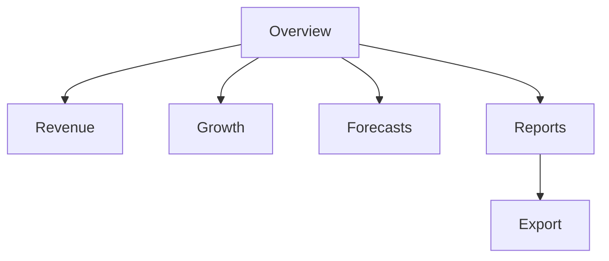

# Business Intelligence Dashboard UX

## Revision History

| Version | Date | Author | Summary |
| --- | --- | --- | --- |
| 1.0 | 2026-07-04 | Design Systems Group | Initial BI dashboard UX specification for IE Platform analytics workflows |

## Table of Contents

1. Purpose
2. Analytical Goals
3. Core KPI Areas
4. Primary Dashboards and Views
5. Interaction Model
6. Analytics Patterns
7. Export and Sharing
8. Accessibility and Performance
9. Glossary
10. Appendix

## 1. Purpose

This document defines the user experience for the Business Intelligence dashboard used by managers, analysts, and business owners. It covers the major analytics and reporting experiences needed to understand booking demand, revenue, growth, forecasts, and performance patterns across the platform and its white-label deployments.

## 2. Analytical Goals

The BI experience should allow users to:

- Review high-value KPIs quickly
- Compare performance over time
- Drill into segments and cohorts
- Interpret forecasts and trends
- Export and communicate insights clearly

## 3. Core KPI Areas

| KPI Area | Examples |
| --- | --- |
| Revenue | Daily revenue, weekly revenue, recurring revenue |
| Growth | New customers, repeat customers, adoption rate |
| Forecasts | Projected bookings, expected revenue, capacity outlook |
| Operations | Booking volume, no-shows, utilization |
| Retention | Repeat visits, churn signals, customer activity |

## 4. Primary Dashboards and Views

| View | Purpose |
| --- | --- |
| Overview Dashboard | High-level KPI summary |
| Revenue View | Revenue trends and segmentation |
| Growth View | Customer acquisition and retention analysis |
| Forecast View | Forecasts, scenarios, and trend expectations |
| Reports View | Detailed operational and business reports |
| Export View | Downloadable and shareable summaries |

## 5. Interaction Model

The BI interface should support progressive analysis.

### Interaction Principles

- Start with a summary, then allow drill-down.
- Keep filtering simple but powerful.
- Present data with context, including date ranges and comparison baselines.
- Preserve a clear difference between absolute values and trend indicators.

### Common Actions

- Select date range
- Apply filters by service, customer segment, or location
- Compare current period with prior period
- Toggle between summary and detailed view

## 6. Analytics Patterns

| Pattern | Use Case |
| --- | --- |
| KPI tiles | High-level performance snapshot |
| Trend chart | View growth and change over time |
| Bar or column chart | Compare performance across dimensions |
| Line chart | View continuity or seasonality |
| Table view | Review granular data |
| Forecast view | Present projected outcomes |

### Required States

- loading
- empty
- populated
- error
- no-data-for-selected-range

## 7. Export and Sharing

The dashboard should support:

- Export to CSV or PDF
- Scheduled report delivery where relevant
- Shareable report links with appropriate permission context
- Clear labeling of report periods and filters

## 8. Accessibility and Performance

- Make charts understandable through labels, legends, and textual summaries
- Support keyboard navigation for filters and drill-down interactions
- Prevent overloading the view with unnecessary chart variety
- Preserve responsive behavior across desktop and tablet environments

## Glossary

| Term | Definition |
| --- | --- |
| KPI | A measurable indicator of business or operational performance |
| Drill-down | The process of moving from a summary view to a more detailed view |

## Appendix

### Related References

- [Operations Dashboard UX](IE-0008.06-Operations-Dashboard-UX.md)
- [Screen Inventory](IE-0008.11-Screen-Inventory.md)
- [Component Library](IE-0008.10-Component-Library.md)
