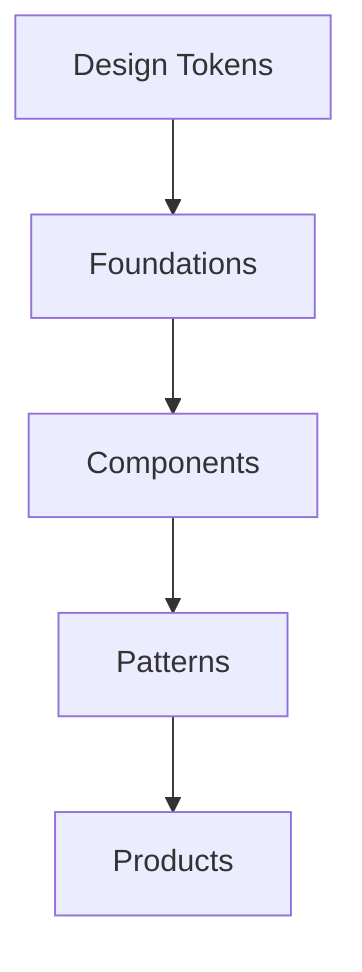

# Design System

## Revision History

| Version | Date | Author | Summary |
| --- | --- | --- | --- |
| 1.0 | 2026-07-04 | Design Systems Group | Initial design system specification for the IE Platform |

## Table of Contents

1. Purpose
2. Design System Foundations
3. Color Palette
4. Typography
5. Spacing
6. Grid
7. Elevation
8. Border Radius
9. Shadows
10. Dark Theme
11. Light Theme
12. Icons
13. Illustrations
14. Brand Usage
15. Glossary
16. Appendix

## 1. Purpose

This document defines the visual and interaction foundation for the IE Platform design system. It is intended to support all digital surfaces, including the customer app, business dashboard, analytics surfaces, and platform admin experience, while preserving the ability to adapt the system for white-label deployments.

## 2. Design System Foundations

The design system is built around a scalable token model and a shared component architecture. The system must remain consistent across product modes while allowing business-specific visual variation.

## 3. Color Palette

| Role | Light Mode | Dark Mode | Usage |
| --- | --- | --- | --- |
| Primary | #2563EB | #60A5FA | Core actions and identity |
| Secondary | #475569 | #94A3B8 | Supporting interaction |
| Success | #16A34A | #4ADE80 | Positive states |
| Warning | #D97706 | #FBBF24 | Attention states |
| Error | #DC2626 | #F87171 | Failure and destructive actions |
| Neutral | #F8FAFC / #0F172A | #111827 | Surfaces and text |
| Surface | #FFFFFF / #111827 | #0F172A | Containers |

### Color Usage Rules

- Do not rely on color alone to communicate state.
- Maintain semantic consistency across light and dark themes.
- Preserve contrast for labels, status indicators, and primary actions.

## 4. Typography

| Role | Size | Weight | Usage |
| --- | --- | --- | --- |
| Display | 40px | 700 | Hero/title emphasis |
| Heading 1 | 32px | 700 | Page titles |
| Heading 2 | 24px | 600 | Section headings |
| Heading 3 | 20px | 600 | Subsections |
| Body | 16px | 400 | Primary content |
| Caption | 12px | 400 | Metadata and helper text |
| Button | 14px | 600 | Button labels |

### Type Rules

- Use a single primary type family for consistency.
- Maintain strong hierarchy and readable line heights.
- Keep text alignment and spacing deliberate.

## 5. Spacing

The spacing system uses an 8-point scale.

| Token | Value |
| --- | --- |
| space-1 | 4px |
| space-2 | 8px |
| space-3 | 12px |
| space-4 | 16px |
| space-5 | 24px |
| space-6 | 32px |
| space-7 | 40px |
| space-8 | 48px |
| space-9 | 64px |

## 6. Grid

| Surface | Grid |
| --- | --- |
| Mobile | 4-column grid |
| Tablet | 8-column grid |
| Desktop | 12-column grid |

### Grid Rules

- Align content to the grid consistently.
- Use spacing to form rhythm rather than arbitrary layout alignment.

## 7. Elevation

| Elevation | Use |
| --- | --- |
| 0 | Flat surfaces |
| 1 | Cards and standard containers |
| 2 | Overlays and active surfaces |
| 3 | Modals and focused content |

## 8. Border Radius

| Token | Value |
| --- | --- |
| radius-sm | 8px |
| radius-md | 12px |
| radius-lg | 16px |
| radius-xl | 24px |

## 9. Shadows

Shadows should be subtle and functional. They are used to distinguish elevated surfaces, not to create decorative emphasis.

## 10. Dark Theme

The dark theme must preserve contrast, readability, and semantic meaning. The same component hierarchy and spacing rules apply.

## 11. Light Theme

The light theme should be clear, airy, and highly legible. It should support extended reading and dense management surfaces.

## 12. Icons

Icons should be simple, precise, and consistent with the product’s tone. They must support meaning without ambiguity and remain legible at small sizes.

## 13. Illustrations

Illustrations should be minimal and task-focused. They should be used to provide context or reinforce a system state rather than decorate the interface.

## 14. Brand Usage

Brand usage must preserve the core IE Platform identity while allowing each white-label deployment to express its own presence. Brand customization should be limited to approved surfaces and should not break the shared interaction system.

## Glossary

| Term | Definition |
| --- | --- |
| Token | A reusable design value such as a color, radius, or spacing value |
| White-label | A product configuration that allows a business to present the experience under its own brand |

## Appendix

### Related References

- [Design Language and Brand Standards](IE-0003A-Design-Language-and-Brand-Standards.md)
- [Shared Component Library Standard](IE-0003B-Shared-Component-Library-Standard.md)
- [Component Library](IE-0008.10-Component-Library.md)
