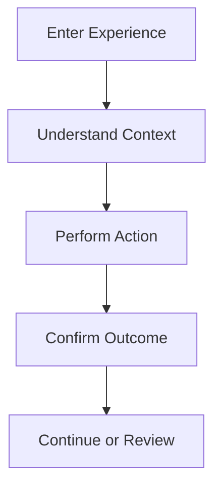

# User Flow Specification

## Revision History

| Version | Date | Author | Summary |
| --- | --- | --- | --- |
| 1.0 | 2026-07-04 | Design Systems Group | Initial user flow specification for IE Platform customer, business, analytics, and admin journeys |

## Table of Contents

1. Purpose
2. Flow Model
3. Customer Flows
4. Business Flows
5. Analytics Flows
6. Admin Flows
7. Flow Governance
8. Glossary
9. Appendix

## 1. Purpose

This document describes the key user journeys that will be designed for the IE Platform. It provides a structured reference for the experience architecture and ensures that the design system will support these workflows consistently across all product surfaces.

## 2. Flow Model

The user flow model aligns the experience around the following stages:

1. Discover or enter the product
2. Understand the context and options
3. Select or configure the action
4. Confirm or complete the task
5. Receive feedback and continue the journey

## 3. Customer Flows

### Sign Up

1. User opens the app.
2. User selects Sign Up.
3. User enters mobile number or email.
4. User verifies identity with OTP.
5. User creates account and starts using the product.

### Login

1. User opens the app.
2. User enters credentials.
3. System authenticates the user.
4. User enters the home experience.

### Forgot Password

1. User selects Forgot Password.
2. User verifies identity with OTP.
3. User creates a new password.
4. User returns to login.

### Booking

1. User browses services.
2. User selects a service and preferred staff member.
3. User picks a date and time.
4. User reviews booking details.
5. User confirms the booking.
6. User receives confirmation and reminder.

### Reschedule

1. User opens a booking detail.
2. User selects reschedule.
3. User chooses a new available slot.
4. User confirms the change.
5. User receives updated confirmation.

### Cancel

1. User opens booking detail.
2. User selects cancel.
3. User confirms cancellation.
4. User receives a cancellation confirmation.

### Notifications

1. User reviews notification center.
2. User acts on an appointment reminder or update.
3. User returns to the relevant detail or action.

### Profile

1. User opens profile.
2. User updates personal or preference settings.
3. User saves changes and receives feedback.

## 4. Business Flows

### Staff Management

1. Business owner opens staff management.
2. User reviews staff profile and availability.
3. User updates schedule or role information.
4. User publishes the change.

### Service Management

1. Business owner opens service management.
2. User creates or updates a service offering.
3. User adjusts pricing, duration, and availability.
4. User publishes the updated service.

### Reports

1. Business owner opens reports.
2. User selects a report or date range.
3. User applies filters and evaluates trends.
4. User exports or shares insights.

## 5. Analytics Flows

### KPIs and Revenue Review

1. User opens BI overview.
2. User reviews summaries for revenue, bookings, and performance.
3. User drills into specific KPIs.
4. User exports or shares a report.

### Growth and Forecast Review

1. User opens growth or forecast views.
2. User adjusts filters and time ranges.
3. User compares current and projected performance.
4. User saves or exports the view.

## 6. Admin Flows

### Tenant Management

1. Admin opens the tenant management view.
2. Admin searches or filters tenant records.
3. Admin opens a tenant detail.
4. Admin adjusts configuration or subscription state.
5. Admin confirms changes and reviews audit history.

### Branding Configuration

1. Admin opens white-label configuration.
2. Admin edits brand values or assets.
3. Admin previews the experience.
4. Admin publishes the configuration.

### Monitoring and Audit

1. Admin opens monitoring or audit views.
2. Admin reviews alerts or history.
3. Admin takes action or escalates as needed.

## 7. Flow Governance

- Every flow must be traceable to a product or functional requirement.
- Each flow must have a clear success path and fallback path.
- Errors and edge cases must be accounted for in the design.
- Flows must support both web and mobile-specific presentation without changing the underlying interaction model.

## Glossary

| Term | Definition |
| --- | --- |
| User flow | A sequence of steps that a user follows to accomplish a task |
| Success path | The main path through a task when all conditions are met |

## Appendix

### Related References

- [Customer App UX](IE-0008.05-Customer-App-UX.md)
- [Operations Dashboard UX](IE-0008.06-Operations-Dashboard-UX.md)
- [Platform Admin UX](IE-0008.08-Platform-Admin-UX.md)
