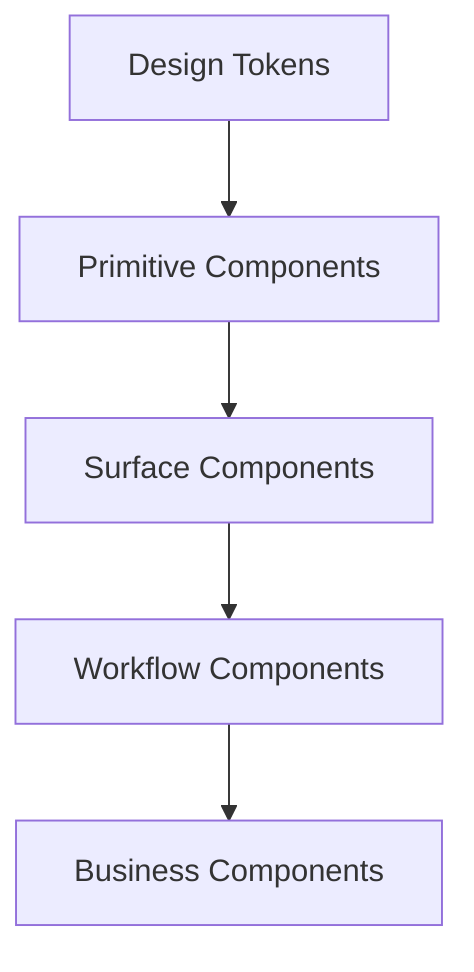

# Design System Specification

## Revision History

| Version | Date | Author | Summary |
| --- | --- | --- | --- |
| 1.0 | 2026-07-04 | Design Systems Group | Initial component specification for the IE Platform design system |

## Table of Contents

1. Purpose
2. System Scope
3. Component Architecture
4. Button
5. Card
6. Input
7. List
8. Modal and Dialog
9. Table
10. Navigation
11. Calendar
12. Date Picker
13. Bottom Sheet
14. Badge
15. Chart
16. Toast
17. Snackbar
18. Skeleton
19. Loading Indicator
20. Implementation Guidance

## 1. Purpose

This specification defines the reusable UI components that will be used to construct the IE Platform experience. Each component is designed to be accessible, responsive, theme-aware, and suitable for both web and mobile interfaces.

## 2. System Scope

The design system covers core product surfaces including:

- Customer experience flows
- Business operations interfaces
- Admin and support experiences
- Analytics and reporting surfaces
- White-label adaptation layers

## 3. Component Architecture

Components are organized into foundational, content, feedback, and business-oriented groups. All components should be built from tokens and shared primitives rather than bespoke implementations.

## 4. Button

### Purpose
Provide a clear primary or secondary action for user intent.

### Properties
- variant: primary, secondary, ghost, destructive
- size: sm, md, lg
- loading
- disabled
- iconLeading
- iconTrailing

### States
- default
- hover
- focus
- active
- disabled
- loading

### Variants
- primary action
- secondary action
- text action
- destructive action

### Accessibility
- Minimum touch target of 44x44px
- Visible focus ring
- Semantic button role

### Usage
Use for confirmation, navigation, submission, and destructive actions.

### Example
Primary action: Continue
Secondary action: Cancel

## 5. Card

### Purpose
Group related content into a single contained surface.

### Properties
- title
- subtitle
- body
- footer
- elevation
- interactive

### States
- default
- hover
- selected
- disabled

### Variants
- informational
- transactional
- metric
- selection

### Accessibility
- Proper heading hierarchy
- Interactive cards must expose keyboard support

### Usage
Use for services, bookings, summaries, and business overview content.

## 6. Input

### Purpose
Collect structured user input.

### Properties
- label
- placeholder
- value
- helperText
- errorText
- disabled
- required
- autocomplete

### States
- default
- focused
- filled
- invalid
- disabled
- loading

### Variants
- text
- email
- password
- search
- number
- textarea
- phone
- date

### Accessibility
- Label must be visible or programmatically associated
- Error descriptions must be announced

### Usage
Use for authentication, profile information, bookings, and administration forms.

## 7. List

### Purpose
Display collections of related items clearly and consistently.

### Properties
- items
- leadingIcon
- trailingAction
- dense
- divider

### States
- default
- selected
- active
- disabled

### Variants
- simple list
- checklist
- settings list
- navigation list

### Accessibility
- Support screen reader reading order
- Use meaningful labels for actions

## 8. Modal and Dialog

### Purpose
Focus the user on a high-priority task or confirmation.

### Properties
- title
- description
- primaryAction
- secondaryAction
- size
- dismissible

### States
- open
- loading
- confirmation
- error

### Variants
- confirmation
- form dialog
- information dialog
- destructive dialog

### Accessibility
- Modal must trap focus while open
- Close action must be keyboard accessible

## 9. Table

### Purpose
Present structured, high-volume data with clear sorting and filtering capabilities.

### Properties
- columns
- rows
- sortable
- selectable
- pagination
- emptyState

### States
- default
- loading
- empty
- sorted
- selected

### Variants
- simple table
- compact table
- sortable table
- data table

### Accessibility
- Use semantic table structure
- Provide column labels and row context

## 10. Navigation

### Purpose
Support movement between pages, sections, and workflows.

### Properties
- items
- activeItem
- collapsed
- badge
- icon

### States
- default
- hover
- active
- current
- disabled

### Variants
- side navigation
- top navigation
- bottom navigation
- tab navigation

### Accessibility
- Provide clear active state and keyboard support

## 11. Calendar

### Purpose
Display day-based or multi-day scheduling information.

### Properties
- dateRange
- selectedDate
- eventMarkers
- monthView
- weekView

### States
- default
- selected
- disabled
- today
- highlighted

### Variants
- month calendar
- week calendar
- availability calendar

### Accessibility
- Provide keyboard navigation
- Include screen-reader labels for dates and events

## 12. Date Picker

### Purpose
Allow users to select dates or ranges.

### Properties
- value
- minDate
- maxDate
- range
- disabled

### States
- default
- focused
- invalid
- disabled

### Variants
- single date
- date range
- time-aware input

### Accessibility
- Provide text entry and calendar selection options

## 13. Bottom Sheet

### Purpose
Expose contextual actions or forms from the lower portion of the viewport.

### Properties
- title
- content
- actions
- snapPoints
- dismissible

### States
- collapsed
- expanded
- loading
- error

### Variants
- action sheet
- form sheet
- filter sheet

### Accessibility
- Ensure content remains reachable and keyboard-operable

## 14. Badge

### Purpose
Indicate status, category, or priority.

### Properties
- label
- tone
- size
- icon

### States
- default
- active
- muted

### Variants
- status badge
- category badge
- notification badge

## 15. Chart

### Purpose
Display quantitative or trend-based information.

### Properties
- data
- type
- axisLabels
- legend
- tooltip

### States
- loading
- empty
- error
- interactive

### Variants
- bar chart
- line chart
- area chart
- pie chart
- stacked chart

### Accessibility
- Provide text summaries and accessible legends

## 16. Toast

### Purpose
Provide short, non-blocking confirmation or feedback.

### Properties
- message
- type
- duration
- actionLabel

### States
- visible
- dismissed
- loading

### Variants
- success
- error
- warning
- info

## 17. Snackbar

### Purpose
Offer brief status messages with an optional action.

### Properties
- message
- actionLabel
- persistent
- duration

### States
- visible
- dismissed

### Variants
- confirmation
- retry
- warning

## 18. Skeleton

### Purpose
Represent loading content while data is being fetched.

### Properties
- shape
- width
- height
- repeat

### States
- loading
- completed

### Variants
- text skeleton
- card skeleton
- table row skeleton

## 19. Loading Indicator

### Purpose
Show progress or processing state for asynchronous actions.

### Properties
- size
- label
- overlay
- indeterminate

### States
- active
- complete
- error

### Variants
- spinner
- progress bar
- inline loader

## 20. Implementation Guidance

- Build components from tokens and primitives.
- Treat accessibility as part of the component contract.
- Document every component with usage guidance and examples.
- Use the same component API across web and mobile surfaces.

## Related Documents

- [UI/UX Architecture Blueprint](IE-0008-UI-UX-Architecture-Blueprint.md)
- [Design Language and Brand Standards](IE-0003A-Design-Language-and-Brand-Standards.md)
- [Shared Component Library Standard](IE-0003B-Shared-Component-Library-Standard.md)
