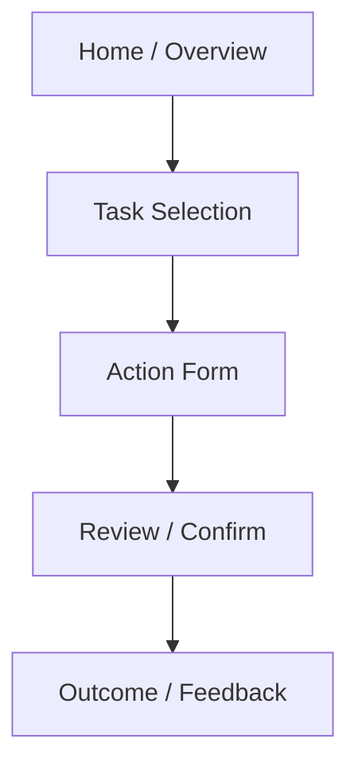
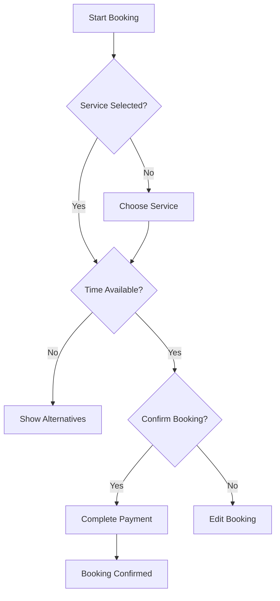
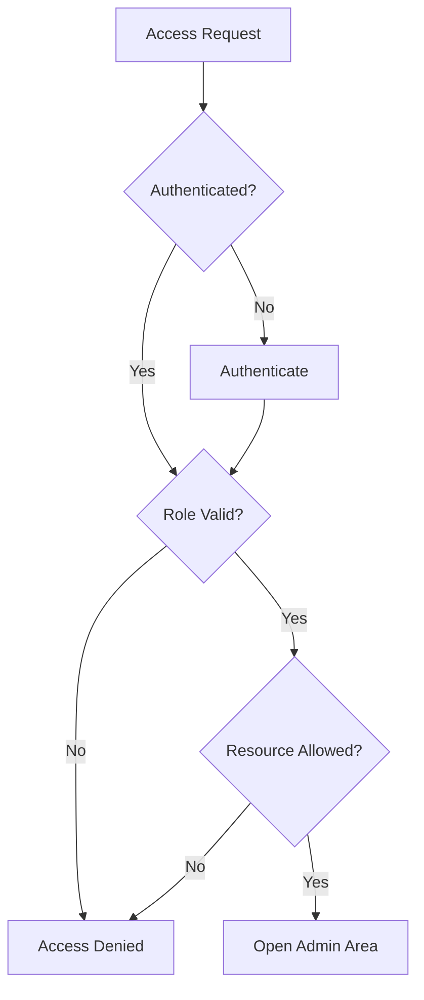

# Navigation and User Flow Specification

## Revision History

| Version | Date | Author | Summary |
| --- | --- | --- | --- |
| 1.0 | 2026-07-04 | Design Systems Group | Initial navigation and user flow specification for the IE Platform |

## Table of Contents

1. Purpose
2. Navigation Principles
3. Customer App Flows
4. Business Dashboard Flows
5. BI Dashboard Flows
6. Platform Admin Flows
7. Shared Cross-Product Paths
8. Decision Trees
9. Navigation Architecture

## 1. Purpose

This document defines the navigation model and primary user flows for the IE Platform. It ensures that customers, business operators, analysts, and administrators can reach the right tasks quickly and consistently regardless of product surface or white-label configuration.

## 2. Navigation Principles

- Navigation should be predictable and role-aware.
- Users should be able to reach core tasks in no more than three steps from a primary entry point.
- Context should persist across tasks such as booking, review, reporting, and account management.
- Deep links should preserve the correct state and context.

## 3. Customer App Flows

### 3.1 Authentication and Onboarding

1. User lands on welcome screen.
2. User chooses sign in or create account.
3. User completes authentication.
4. User completes profile and preference onboarding.
5. User enters the home experience.

### 3.2 Booking Journey

1. User selects a service or provider.
2. User chooses date and time.
3. User confirms details and availability.
4. User completes payment or deposit.
5. User receives confirmation and calendar reminder.

### 3.3 Service Management Journey

1. User opens upcoming appointments.
2. User reschedules, cancels, or rebooks.
3. User receives updated confirmation and notifications.

### 3.4 Profile and Settings Journey

1. User opens profile.
2. User updates contact details, preferences, and notification controls.
3. User saves and receives confirmation.

### Customer Navigation Model

- Home
- Bookings
- Notifications
- Profile
- Settings

## 4. Business Dashboard Flows

### 4.1 Daily Operations Flow

1. Business operator opens dashboard.
2. User reviews day’s bookings, missed appointments, and pending confirmations.
3. User updates schedules and customer communications.
4. User resolves urgent issues from notification center.

### 4.2 Customer Management Flow

1. User opens customer directory.
2. User filters by service, status, or activity.
3. User opens customer detail.
4. User updates notes, preferences, and follow-up tasks.

### 4.3 Staff and Services Flow

1. User opens staff and service management.
2. User adds or edits service offerings.
3. User adjusts availability and capacity.
4. User publishes updates.

### 4.4 Revenue and Booking Oversight Flow

1. User opens reporting or summary views.
2. User examines revenue, attendance, and booking trends.
3. User drills into the relevant segment.
4. User exports or shares a report.

### Business Navigation Model

- Overview
- Bookings
- Customers
- Services
- Staff
- Reports
- Settings

## 5. BI Dashboard Flows

### 5.1 Executive Overview Flow

1. User opens BI overview.
2. User sees KPIs for bookings, appointments, retention, and growth.
3. User drills into trends and segments.
4. User exports a report or shares a snapshot.

### 5.2 Analytical Investigation Flow

1. User selects a metric or trend.
2. User applies filters by date, customer cohort, or service.
3. User compares dimensions and views breakdowns.
4. User saves the view or shares it with stakeholders.

### 5.3 Performance Review Flow

1. User opens a report view.
2. User evaluates performance against historical benchmarks.
3. User makes operational decisions based on trends.

### BI Navigation Model

- Overview
- Reports
- Analytics
- Trends
- Exports
- Alerts

## 6. Platform Admin Flows

### 6.1 User and Tenant Administration Flow

1. Admin opens account and tenant management.
2. Admin filters by business or role.
3. Admin enables, disables, or updates account access.
4. Admin confirms changes and reviews audit history.

### 6.2 Security and Compliance Flow

1. Admin opens security and audit views.
2. Admin reviews failed logins, permission changes, and notable events.
3. Admin triggers a support or remediation workflow.

### 6.3 Platform Configuration Flow

1. Admin opens platform settings.
2. Admin updates feature flags, integrations, or tenant-level defaults.
3. Admin validates state and publishes changes.

### Platform Admin Navigation Model

- Dashboard
- Tenants
- Users
- Security
- Integrations
- Settings
- Audit

## 7. Shared Cross-Product Paths

### Authentication Paths

- Sign in
- Sign up
- Forgot password
- OTP verification
- Password reset

### Notification Paths

- In-app notification center
- Email digest summary
- System alert handling
- Reminder and confirmation flows

### Settings Paths

- Account preferences
- Notification settings
- Theme and accessibility settings
- Security and device management

## 8. Decision Trees

### Booking Decision Tree

### Admin Access Decision Tree

## 9. Navigation Architecture

The navigation system is structured to support layered access:

- Global navigation for high-level product mode switching
- Local navigation for tasks and module-level operations
- Contextual actions for workflow steps
- Search and quick actions for power users

### Navigation Entry Points

- Primary app shell
- Dashboard landing surfaces
- Booking and service task views
- Analytics and reporting workspaces
- Admin workspaces

## Related Documents

- [UI/UX Architecture Blueprint](IE-0008-UI-UX-Architecture-Blueprint.md)
- [Screen Inventory](IE-0008C-Screen-Inventory.md)
- [Design System Specification](IE-0008A-Design-System-Specification.md)
