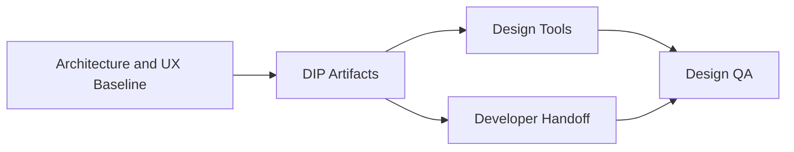

# Design Implementation Package

## Revision History

| Version | Date | Author | Summary |
| --- | --- | --- | --- |
| 1.0 | 2026-07-04 | Design Systems Group | Initial design implementation package for AppointIE and the IE Platform |

## Table of Contents

1. Purpose
2. Package Scope
3. Delivery Model
4. Artifact Summary
5. Governance
6. Glossary
7. Appendix

## 1. Purpose

The Design Implementation Package (DIP) translates the validated UI/UX architecture into a production-ready implementation framework for Figma, Lovable, Penpot, Builder.io, and future AI design tools. It is intended to preserve the architectural intent of the IE Platform while providing practical implementation guidance for design and engineering teams.

## 2. Package Scope

The DIP covers the core implementation concerns that must be resolved before high-fidelity UI work begins:

- Design tooling standards
- AI-assisted prompt design
- Token mapping across design and implementation layers
- Component mapping for reusable UI delivery
- Prototype and interaction specification
- Developer handoff rules
- Asset organization
- Quality assurance for design delivery

## 3. Delivery Model

## 4. Artifact Summary

| Document | Purpose |
| --- | --- |
| IE-0009.01 | Tooling standards and file governance |
| IE-0009.02 | AI design prompt library |
| IE-0009.03 | Design token mapping |
| IE-0009.04 | Component mapping |
| IE-0009.05 | Prototype specification |
| IE-0009.06 | Developer handoff guide |
| IE-0009.07 | Asset organization |
| IE-0009.08 | Design QA checklist |

## 5. Governance

- All assets must align to the IE Platform architecture and the existing design system.
- White-label customization must remain constrained to approved surfaces and tokens.
- Variants and components must be reusable and documented before being promoted into design tools.
- Every artifact must preserve accessibility, consistency, and multi-tenant product requirements.

## Glossary

| Term | Definition |
| --- | --- |
| DIP | Design Implementation Package used to prepare high-fidelity design and implementation work |
| White-label | A deployment model that preserves shared platform capability while allowing brand-specific presentation |

## Appendix

### Related References

- [UI/UX Architecture Blueprint](IE-0008-UI-UX-Architecture-Blueprint.md)
- [Design System](IE-0008.09-Design-System.md)
- [Component Library](IE-0008.10-Component-Library.md)
