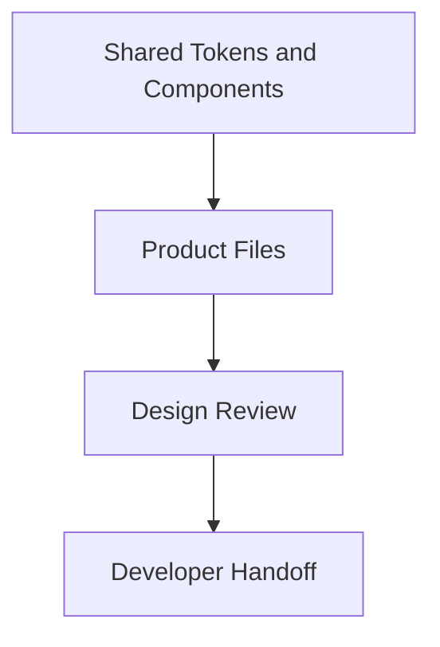

# Design Tool Standards

## Revision History

| Version | Date | Author | Summary |
| --- | --- | --- | --- |
| 1.0 | 2026-07-04 | Design Systems Group | Initial standards for design tooling and file organization |

## Table of Contents

1. Purpose
2. Supported Design Tools
3. File and Naming Standards
4. Component and Variant Standards
5. Token and Library Standards
6. Delivery Workflow
7. Glossary
8. Appendix

## 1. Purpose

This document defines the standards that govern the use of design tools for the IE Platform. It ensures that work created in Figma, Lovable, Penpot, Builder.io, or future design tools remains coherent, reviewable, and implementation-ready.

## 2. Supported Design Tools

| Tool | Role | Notes |
| --- | --- | --- |
| Figma | Primary UI design and component authoring | Required for shared design libraries and handoff |
| Lovable | Rapid product experience prototyping and AI-assisted exploration | Must use approved tokens and components |
| Penpot | Cross-platform collaboration | Used for open or browser-based reviews |
| Builder.io | Page-level composition and structured content experiences | Must remain aligned with the shared component system |
| Future tools | AI-assisted generation and visual iteration | Must import or map the same tokens and component contracts |

## 3. File and Naming Standards

### File Organization

- Maintain a shared workspace per product surface.
- Keep platform-wide tokens and libraries separate from product-specific files.
- Store each experience surface in its own file or section.

### Page Naming

- Use concise and descriptive page names such as `01-Overview`, `02-Booking`, `03-Settings`.

### Frame Naming

- Name frames by screen role and flow state: `Customer App - Booking Review`, `Dashboard - Calendar`. 

### Layer Naming

- Use semantic names: `Primary Button`, `Error Message`, `Booking Card`.
- Avoid purely positional names such as `Rectangle 12`.

### Auto Layout Rules

- Use Auto Layout for responsive components and reusable patterns.
- Preserve consistent spacing tokens and alignment logic.
- Avoid manual resizing where Auto Layout can preserve structure.

## 4. Component and Variant Standards

- Every reusable UI element must be defined as a component.
- Variants must represent meaningful states such as default, hover, active, disabled, loading, and selected.
- Shared library components must be used before product-specific variants are introduced.

## 5. Token and Library Standards

- Keep design tokens centralized in the base library.
- Define variables for colors, spacing, radius, typography, motion, and elevation.
- Expose only approved tokens in product files.
- Do not duplicate values locally when a shared token exists.

## 6. Delivery Workflow

## Glossary

| Term | Definition |
| --- | --- |
| Variant | A defined state or alternate form of a component |
| Library | A shared collection of tokens, components, and patterns available to design files |

## Appendix

### Related References

- [Design System](IE-0008.09-Design-System.md)
- [Component Library](IE-0008.10-Component-Library.md)
