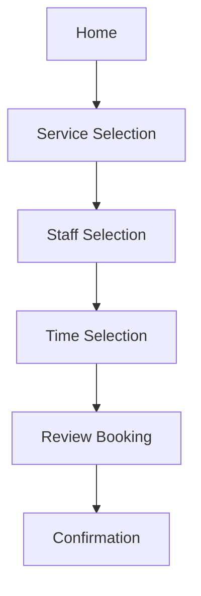
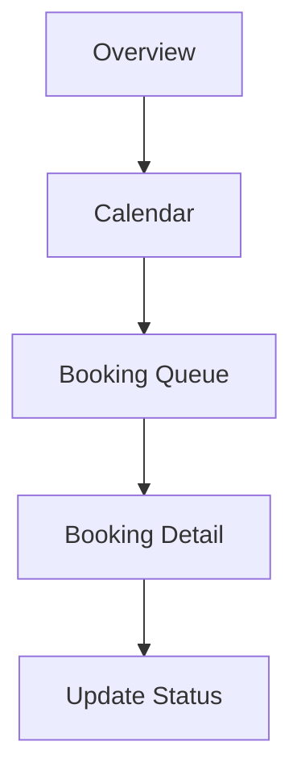

# Prototype Specification

## Revision History

| Version | Date | Author | Summary |
| --- | --- | --- | --- |
| 1.0 | 2026-07-04 | Design Systems Group | Initial prototype specification for interaction and motion guidance |

## Table of Contents

1. Purpose
2. Interaction Principles
3. Navigation Flows
4. Transitions and Motion
5. States and Feedback
6. Glossary
7. Appendix

## 1. Purpose

This document defines the interaction and prototype expectations for the IE Platform. It ensures that prototypes built in Figma, Lovable, Penpot, Builder.io, or other tools communicate the correct transitions, states, and usability behavior.

## 2. Interaction Principles

- Interactions should feel immediate and predictable.
- Motion should reinforce hierarchy without distraction.
- States must clearly communicate progress, completion, errors, and offline conditions.
- Every flow should preserve accessibility and touch-friendly targets.

## 3. Navigation Flows

### Customer Booking Flow

### Operations Dashboard Flow

## 4. Transitions and Motion

| Interaction | Motion | Duration |
| --- | --- | --- |
| Screen transition | slide or fade | 180-240ms |
| Component state change | ease-out | 150ms |
| Modal entry | spring or fade | 180ms |
| Loading transition | subtle shimmer or skeleton | 200-400ms |

## 5. States and Feedback

| State | Required Behavior |
| --- | --- |
| Loading | Show skeleton or progress indication |
| Empty | Provide guidance and next action |
| Error | Display error explanation and recovery action |
| Offline | Show status and preserve recoverability |
| Success | Confirm completion with feedback and next step |

## Glossary

| Term | Definition |
| --- | --- |
| Prototype | A realistic interactive model of an experience used for validation and communication |
| Transition | A visual change between states during interaction |

## Appendix

### Related References

- [AI Design Prompt Library](IE-0009.02-AI-Design-Prompt-Library.md)
- [Component Mapping](IE-0009.04-Component-Mapping.md)
