# IE-0005.04 — AppointIE OPS Mobile App User Guide

## Revision History

| Version | Date | Author | Summary |
| --- | --- | --- | --- |
| 1.0.0 | 2026-07-26 | Product Documentation | Initial guide with Demo Salon screenshots |
| 1.1.0 | 2026-07-26 | Product Documentation | Expanded how-it-works detail for every major screen |

## Purpose

This guide explains **how OPS Mobile works** for day-to-day AppointIE operations — not only what each screen is called, but what you see, what you can do, and what happens when you take an action.

It includes:

1. **Feature catalog** — screen-by-screen behavior  
2. **How-to flows** — end-to-end task recipes  

Screenshots are from the seeded **Demo Salon** workspace on iOS (Expo Go).

## Audience and access

| Role | What they can do in OPS Mobile |
| --- | --- |
| Business owner | Full access: bookings, customers, services, staff, offices, settings, billing, team, BI |
| Manager | Same operational breadth as owner for Settings, Team, staff directory, BI/Reports (as permitted) |
| Staff | Bookings, calendar, and customers; **no** staff directory, Settings, Team, or BI/Reports unless permissions override |

**Soft lock:** If a trial or billing period has ended, you can usually still view data, but creating bookings / adding staff / adding offices may be blocked until you renew or upgrade under **Settings → Products & plans**.

## App surface

- **Product:** AppointIE  
- **Client:** OPS Mobile (`apps/ops-mobile`)  
- **Bottom tabs:** Home · Bookings · Calendar · Alerts · More  

## Demo credentials (local)

| Item | Value |
| --- | --- |
| Workspace | Demo Salon (`demo` / `MAIN`) |
| Owner email | `pilot-owner@ieplatform.local` |
| Owner password | `PilotPass123!` |

---

## 1. Overview — how the app is organized

After you sign in, OPS Mobile opens into a five-tab shell:

| Tab | How it works |
| --- | --- |
| **Home** | Daily snapshot: next booking, KPIs, revenue, shortcuts |
| **Bookings** | Searchable list of appointments; create and open details |
| **Calendar** | Pick a day on the month grid; work that day’s agenda and open slots |
| **Alerts** | Business notifications; tap to mark read and jump to related booking |
| **More** | Everything else — customers, services, staff, reviews, BI, offices, settings, team, profile |

From Home and several lists you can also open **Search** to find customers, staff, or services without browsing each module.

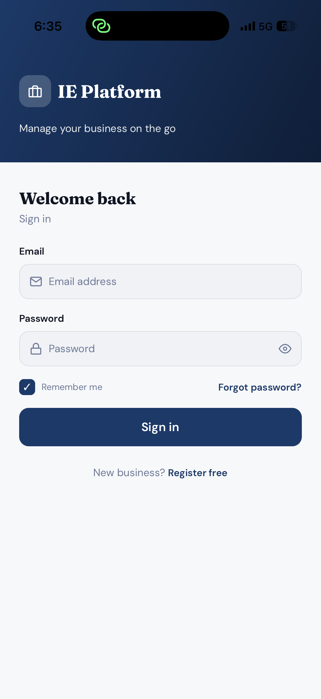

*Figure 1 — Sign in is the entry point before the tab shell loads.*

---

## 2. Authentication — how sign-in and registration work

### 2.1 Sign in

**What this screen does**  
Authenticates an owner, manager, or staff user and loads their workspace.

**How it works**

1. Enter **Email** and **Password**.  
2. Leave **Remember me** on if you want the session kept on this device (default is on).  
3. Tap **Sign in**.  
4. On success, the app loads your workspace (Demo Salon in these screenshots) and lands on **Home**.  
5. If Face ID / biometrics were previously enabled, you may see a biometric sign-in option instead of typing the password every time.

**Also on this screen**

- **Forgot password?** — opens the reset flow  
- **Register free** — starts new-business onboarding  

*Figure 2 — Sign in: email, password, Remember me, Forgot password, Register free.*

### 2.2 Forgot password

**What this screen does**  
Starts a password reset for an existing account.

**How it works**

1. Enter the account **Email**.  
2. Tap **Send reset link**.  
3. The app confirms that *if* an account exists, a reset email was sent (local/dev: check Mailpit).  
4. Use **Back to sign in** to return.

You do not learn whether the email exists — this is intentional for security.

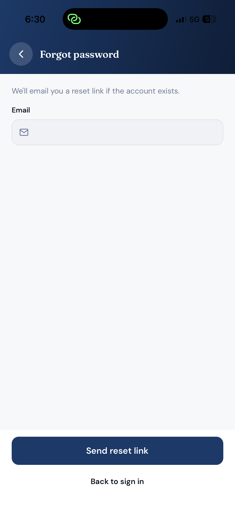

*Figure 3 — Forgot password sends a reset link when the account exists.*

### 2.3 Register a new business

**What this screen does**  
Creates a new workspace (tenant + business) and owner login through a multi-step wizard.

**How it works (4 steps)**

1. **Account** — first name, last name, email, mobile, password (min 8 characters), confirm password.  
2. **Business** — legal/display name, business email, phone, address fields.  
3. **Preferences** — timezone, currency, language, product (AppointIE).  
4. **Branding** — optional colors/logo; create workspace or skip branding.

When creation finishes, you are signed into the new workspace automatically.

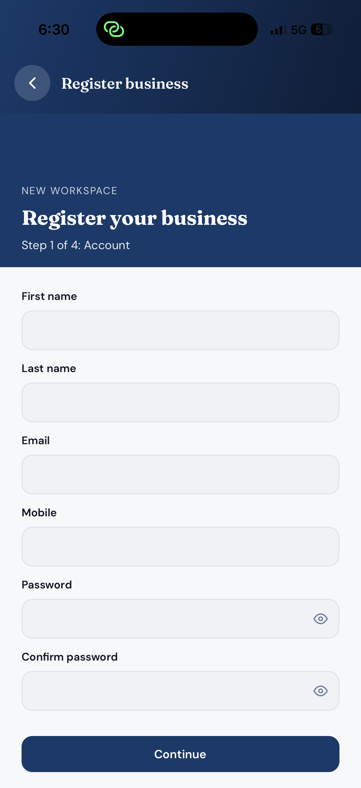

*Figure 4 — Register business Step 1 (Account). Later steps collect business, preferences, and branding.*

---

## 3. Daily operations — how each tab works

### 3.1 Home / Dashboard

**What this screen does**  
Gives you a morning (or anytime) control center: what is next today, key counts, and shortcuts so you rarely need to hunt through menus.

**How it works**

1. The header shows the **workspace name** (Demo Salon) and a time-based greeting.  
2. **Next up today** highlights the next upcoming appointment, or prompts you to create one if the day is empty.  
3. KPI tiles show live counts:
   - **Today** — bookings on today’s date  
   - **Customers** — customers in this workspace  
   - **Staff** — active team members (role-dependent)  
   - **Services** — active services  
4. **Est. revenue · 30 days** estimates revenue from recent bookings (managers/owners). Tapping it typically opens BI.  
5. Quick actions (**Booking**, **Customers**, **Services**, **Staff**) jump straight into those modules.  
6. **Upcoming today** lists the next few appointments; tap one to open booking detail, or **See all** to open the Bookings tab.  
7. Pull down to refresh; use the floating/new-booking action when available.

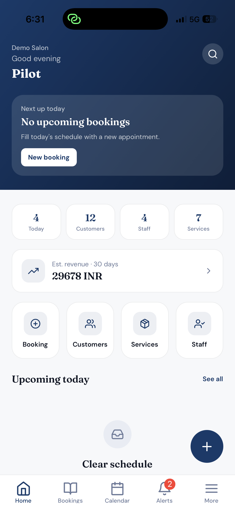

*Figure 5 — Home: KPIs, revenue, quick actions, and today’s upcoming list.*

### 3.2 Bookings list

**What this screen does**  
Shows appointments for operations work — especially today’s schedule — with search and filters.

**How it works**

1. Open the **Bookings** tab.  
2. Use **Search** to match booking number, customer, service, staff, or status text.  
3. Switch **Today / All** (or equivalent chips) and open **Filters** for status, staff (managers+), and sort order.  
4. Each card shows:
   - Service name  
   - Time  
   - Customer  
   - Assigned staff  
   - Status (e.g. Confirmed, Pending)  
   - Booking number (e.g. `#DEMO-BK-019`)  
5. Tap a card to open **Booking detail**.  
6. Tap **New** / **+** to start **Create booking**.

Statuses you will commonly see: `pending`, `confirmed`, `checked_in`, `in_progress`, `completed`, `cancelled`, `no_show`.

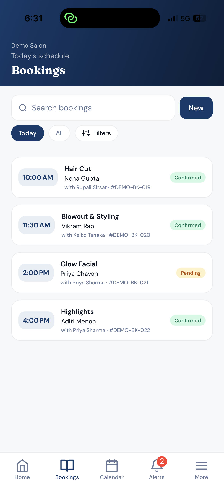

*Figure 6 — Bookings list: searchable cards with status and booking numbers.*

### 3.3 Booking detail — how status actions work

**What this screen does**  
Lets you progress one appointment through its lifecycle and keep an audit-friendly reason when needed.

**How it works**

1. Open any booking from Home, Bookings, Calendar, or Alerts.  
2. Review the summary: service, booking number, status badge, customer, staff, date/time, duration, price, notes, and any customer review.  
3. If you can write bookings, an optional **Reason** field is available for cancel/reschedule style actions.  
4. Action buttons appear based on **current status**:

| Action | When it appears | What happens |
| --- | --- | --- |
| **Confirm** | `pending` / `draft` | Accepts the appointment onto the schedule |
| **Check in** | `confirmed` / `pending` | Marks the customer as arrived |
| **Complete** | `confirmed` / `checked_in` / `in_progress` | Marks the visit finished |
| **Reschedule** | Not cancelled/completed/rejected | Pick a new open slot for same service/staff/duration |
| **Cancel booking** | Not already finished/cancelled | Cancels; reason recommended for audit |

5. After an action succeeds, the status badge updates and lists/calendar reflect the change.

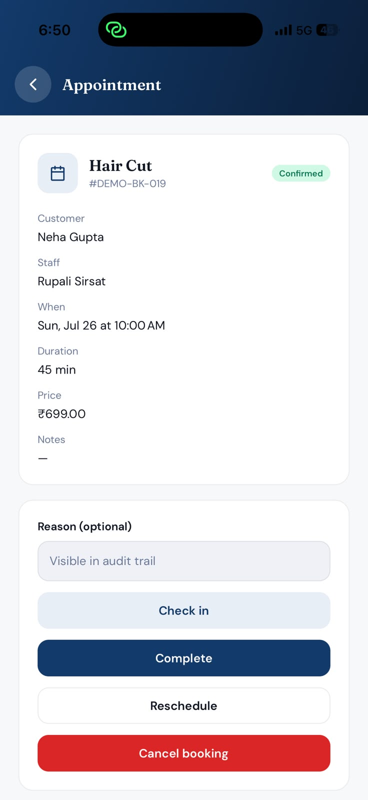

*Figure 7 — Booking detail with Check in, Complete, Reschedule, and Cancel.*

### 3.4 Create booking — how the three-step flow works

**What this screen does**  
Creates a new appointment from OPS Mobile (recorded as an operations booking on the mobile channel).

**How it works**

**Step A — Who & what**

1. Select **Customer** (required).  
2. Select **Service** (required) — this drives duration and available slots.  
3. Select **Office** when the business has more than one location (Demo Salon has Kalyani Nagar / Baner).  
4. Optionally choose **Staff**, or leave **Any available**.  
5. Changing service/staff clears a previously picked time so slots stay valid.

**Step B — Date & time**

1. Pick a day on the month calendar.  
2. The app loads **only open slots** for that service/staff/duration.  
3. If you see “Select a service to load available times,” go back and choose a service first.  
4. Tap a slot to select it.

**Step C — Notes**

1. Optionally add notes for the team.  
2. Tap **Create booking**.  
3. On success you are taken to the new booking’s detail screen, and it appears on Bookings/Calendar.

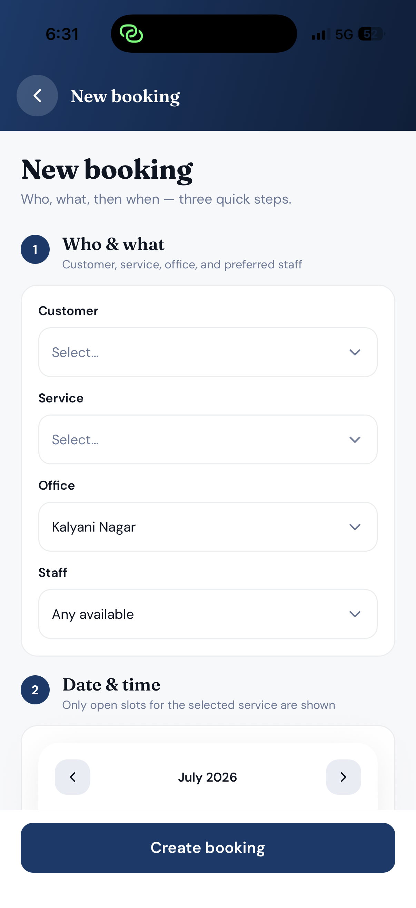

*Figure 8 — Create booking Step A: customer, service, office, staff.*

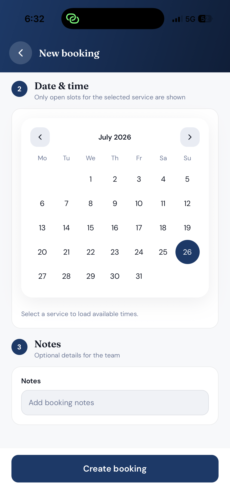

*Figure 9 — Create booking Steps B–C: calendar slots and optional notes.*

### 3.5 Calendar

**What this screen does**  
Lets you plan by date: choose a day, review that day’s agenda, and jump into free slots.

**How it works**

1. Open **Calendar**.  
2. Move months with the arrows; tap a day in the grid (selected day is highlighted).  
3. **Day agenda** lists that day’s bookings (same card style as Bookings).  
4. Use filters (status / staff for managers) to focus the agenda.  
5. Tap a booking to open detail.  
6. If open slots are shown, tap a slot to start **Create booking** with that start time prefilled.  
7. Empty day → use New booking to fill the schedule.

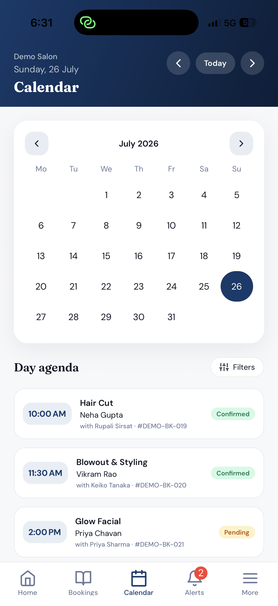

*Figure 10 — Calendar grid plus the selected day’s agenda.*

### 3.6 Alerts (notifications)

**What this screen does**  
Shows business-side notifications so owners/managers can react quickly without refreshing Bookings manually.

**How it works**

1. Open **Alerts**. The tab badge shows unread count when available.  
2. Each row includes subject, short body, and relative time (e.g. “2 hr ago”).  
3. Typical events: new booking request, customer checked in, new review, daily schedule digest, cancellation, no-show.  
4. Tap a row to mark it read. If it is linked to a booking, the app opens that booking detail.  
5. Use **Mark all read** to clear the inbox unread state.  
6. Pull to refresh for the latest events.

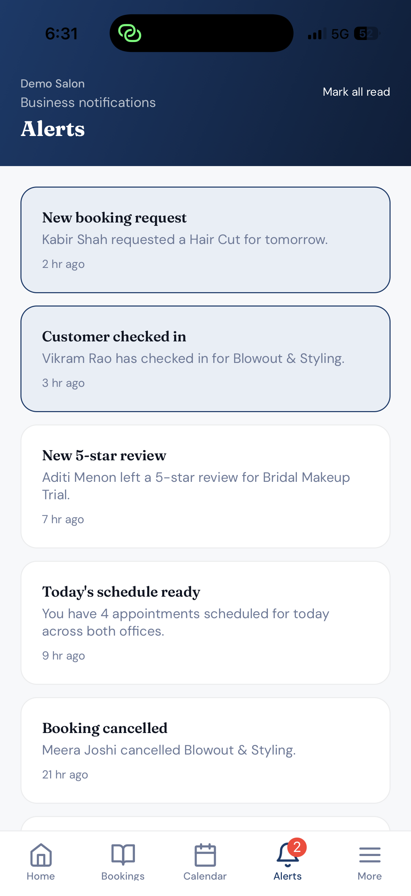

*Figure 11 — Alerts inbox with booking and review notifications.*

### 3.7 Global search

**What this screen does**  
Searches across customers, staff, and services from one field.

**How it works**

1. Open Search from Home/header (or the Search screen).  
2. Type part of a name (example: `fac` for Glow Facial).  
3. Matching results appear as you type; tap a result to open that record.  
4. If the list is empty, broaden the keyword or check spelling.

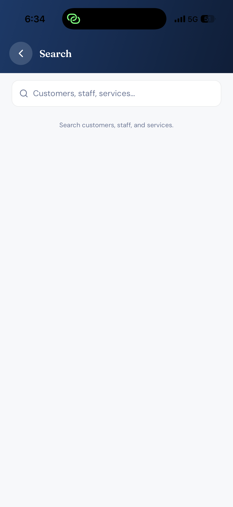

*Figure 12 — Empty search waiting for a query.*

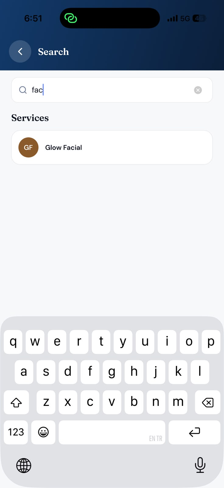

*Figure 13 — Search results returning a matching service.*

---

## 4. Catalog & people — how services, customers, and staff work

### 4.1 Services

**What this module does**  
Maintains what customers can book: name, duration, price, status, and optional image.

**How the list works**

1. Open **More → Services** (or Home quick action).  
2. Search by service name.  
3. Each row shows duration, price, and `active` status.  
4. Managers/owners with write access can add a service.  
5. Tap a row for detail.

**How detail / edit works**

1. Detail shows description, duration, price, status, and **Book this service** (starts create-booking with that service).  
2. **Edit** opens the form: change image, name, description, duration, and price.  
3. Saving updates the catalog immediately for future bookings (existing bookings keep their historical values unless separately changed).

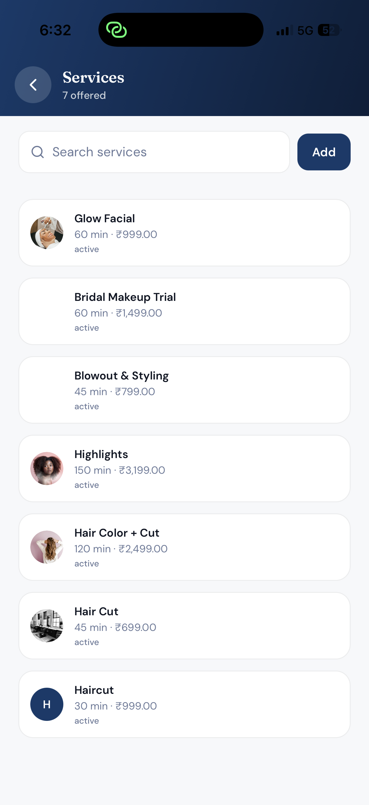

*Figure 14 — Services catalog with duration and price.*

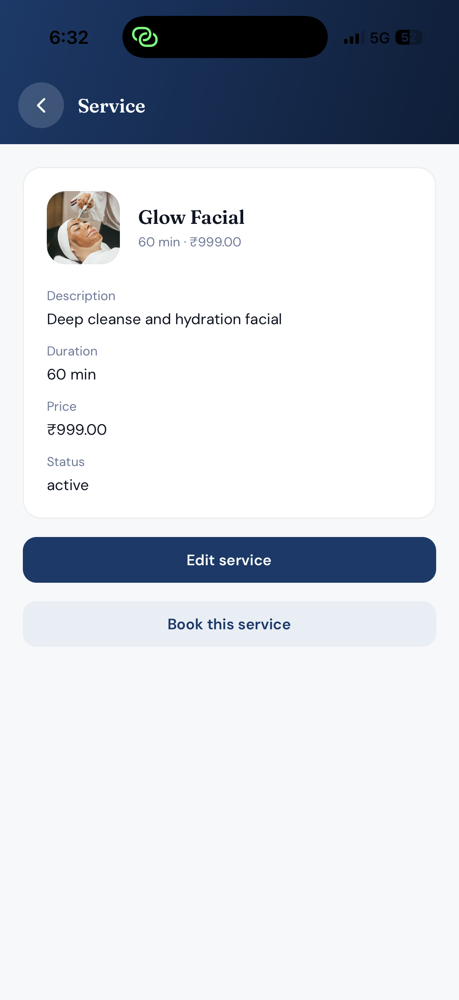

*Figure 15 — Service detail and Book this service.*

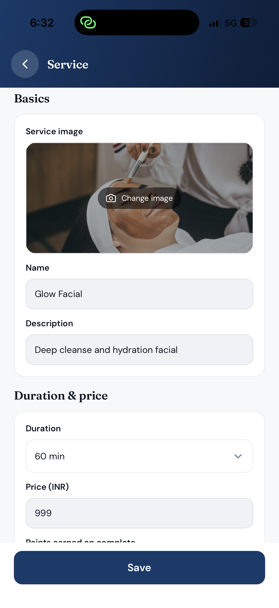

*Figure 16 — Edit service form (image, name, duration, price).*

### 4.2 Customers

**What this module does**  
Stores people you book for, including contact info and recent review history.

**How the list works**

1. Open **More → Customers**.  
2. Search by name/email.  
3. Tap a customer to open detail.  
4. Use **Add customer** to create a new record.

**How add/detail works**

1. **Add customer** collects display/first/last name, email, phone, and optional address.  
2. Address can use Google Places autocomplete when `EXPO_PUBLIC_GOOGLE_PLACES_API_KEY` is configured; otherwise enter the address manually.  
3. Detail shows contact fields, recent reviews (tap through to the related booking), **New booking**, and edit/deactivate controls when allowed.  
4. Creating a booking from customer detail prefills that customer in the create flow.

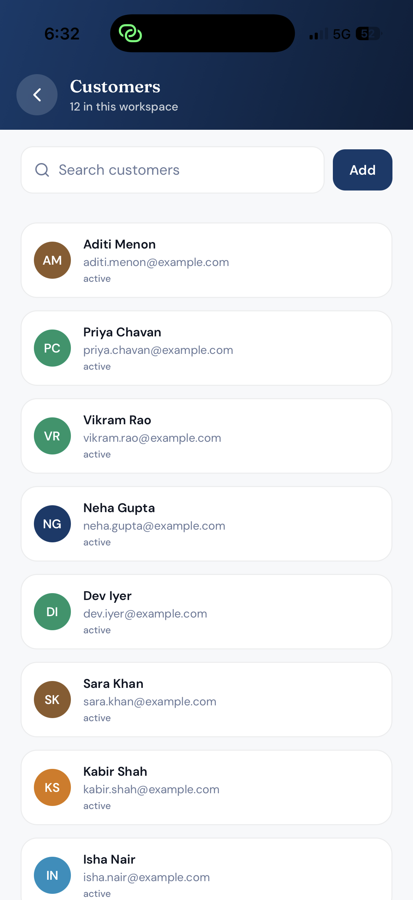

*Figure 17 — Customers directory.*

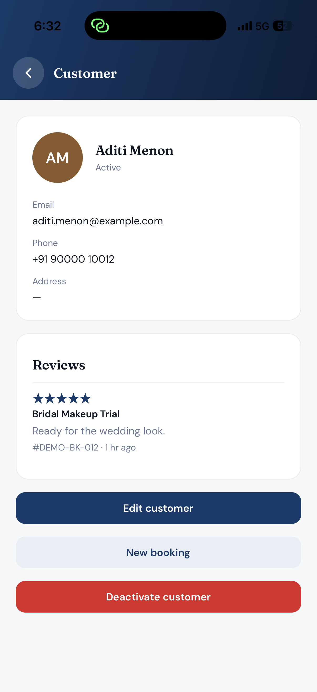

*Figure 18 — Customer detail with reviews and New booking.*

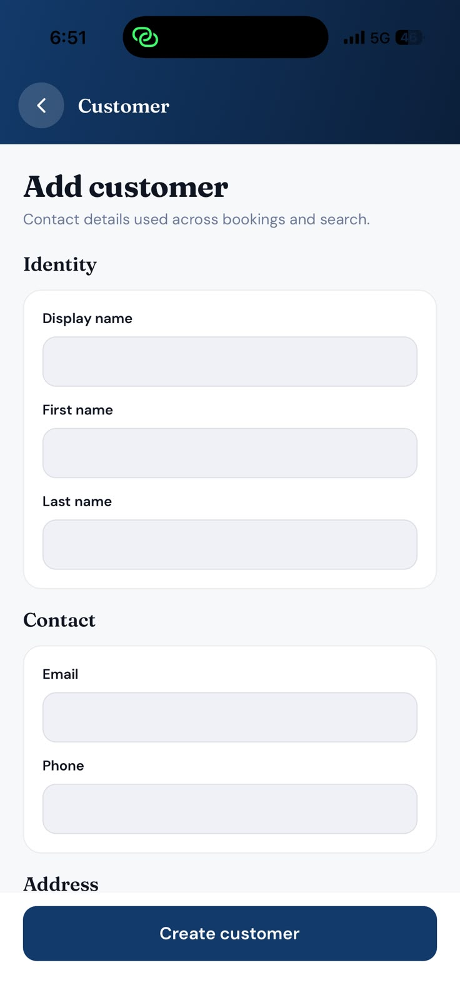

*Figure 19 — Add customer form.*

### 4.3 Staff

**What this module does**  
Defines who can be assigned to appointments, when they work, and whether they can log into OPS Mobile.

**How the list / detail work**

1. Managers/owners open **More → Staff**.  
2. Search the directory; tap a person for detail.  
3. Detail shows contact, whether an app login is linked, weekly schedule preview, and actions: Edit staff, Edit schedule, leave/special hours/services, Book with staff, Deactivate.

**How edit access works**

1. **Available for bookings** — when off, the person does not appear as a bookable stylist and does not consume a staff seat the same way.  
2. **App access role**
   - **Staff** — bookings, calendar, customers only  
   - **Manager** — also Settings, Team, staff directory, reports/BI  
3. Changing role updates OPS-Mobile access immediately after save.

**How weekly schedule works**

1. Open schedule editor for the staff member.  
2. For each day, set whether they work and the **Start / End** times.  
3. Save schedule.  
4. Availability for create-booking slots uses this weekly pattern, minus leave and respecting service assignments.

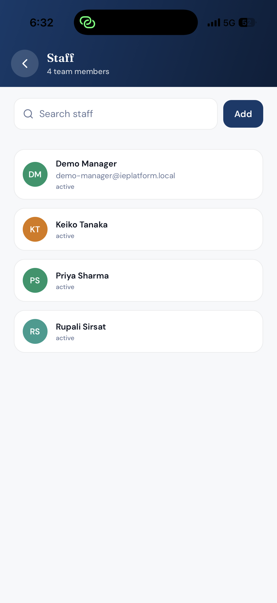

*Figure 20 — Staff directory.*

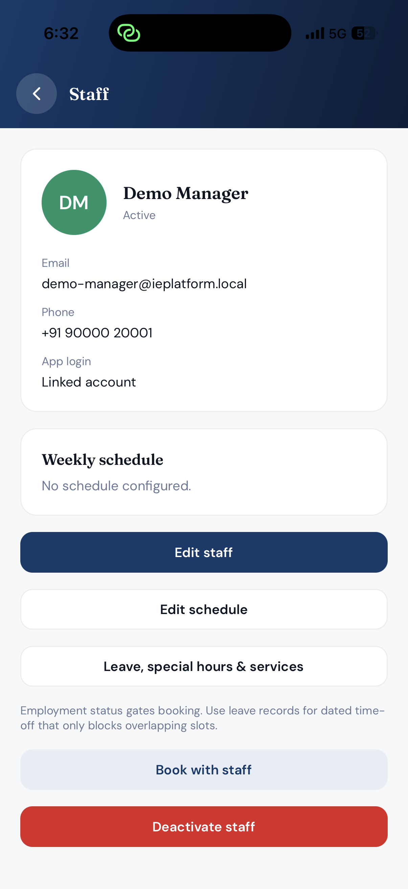

*Figure 21 — Staff detail with schedule and edit actions.*

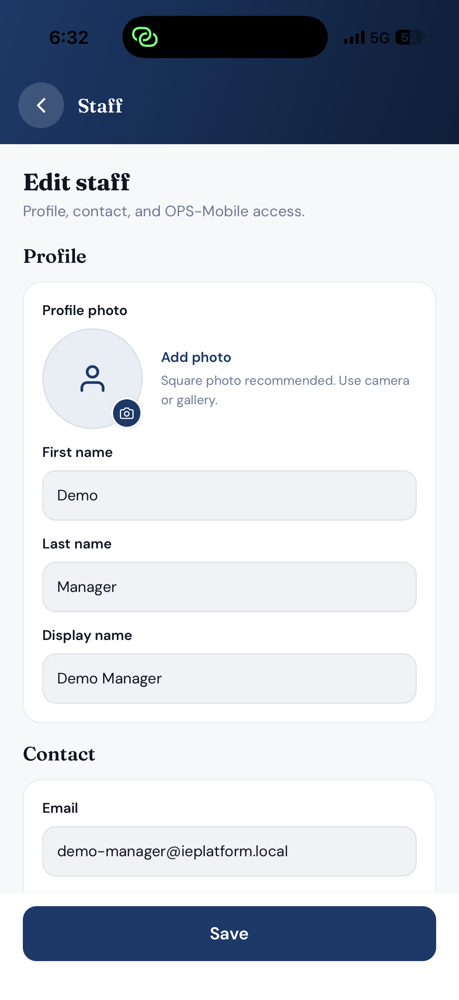

*Figure 22 — Edit staff profile and contact.*

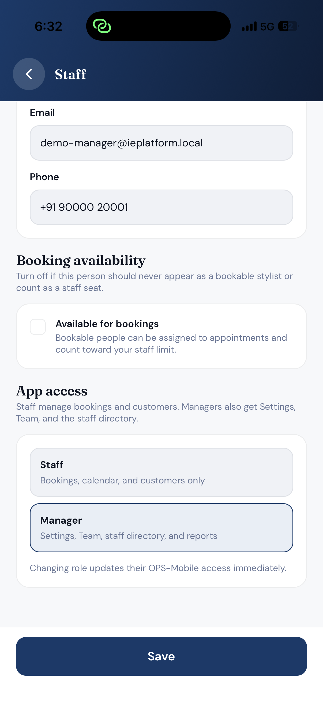

*Figure 23 — Bookable toggle and Staff vs Manager access.*

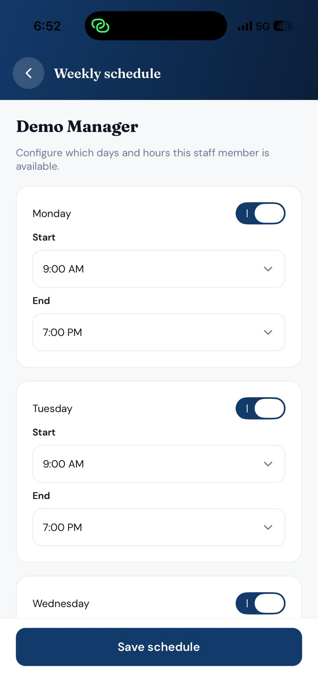

*Figure 24 — Weekly schedule editor with start/end times.*

---

## 5. More menu, analytics, and settings — how configuration works

### 5.1 More menu

**What this screen does**  
Acts as the module launcher for anything not in the bottom tabs.

**How it works**

1. Open **More**.  
2. The header shows who is signed in (name, email, workspace, role).  
3. Tap a business module (Customers, Reviews, Services, Staff, BI, Reports, Offices, Settings, Team).  
4. Items you are not allowed to see (for example Staff/BI for a basic staff role) are hidden.  
5. Use Profile / Sign out from the account area.

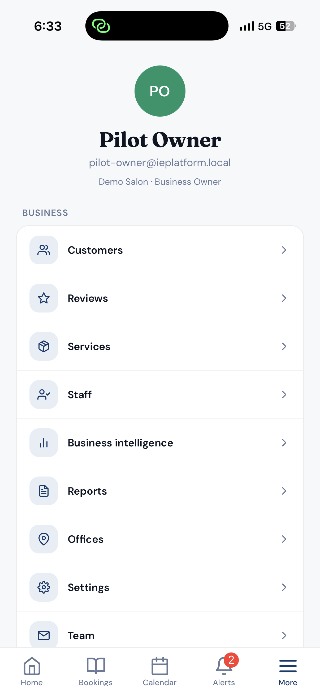

*Figure 25 — More menu for Demo Salon owner.*

### 5.2 Reviews

**What this screen does**  
Aggregates customer ratings/comments from completed bookings.

**How it works**

1. Open **More → Reviews**.  
2. Search by customer, service, or note text.  
3. Each card shows customer, service, booking number, time, and comment.  
4. Tap a review to open the related booking when linked.  
5. Reviews appear after customers rate completed visits — empty until that happens.

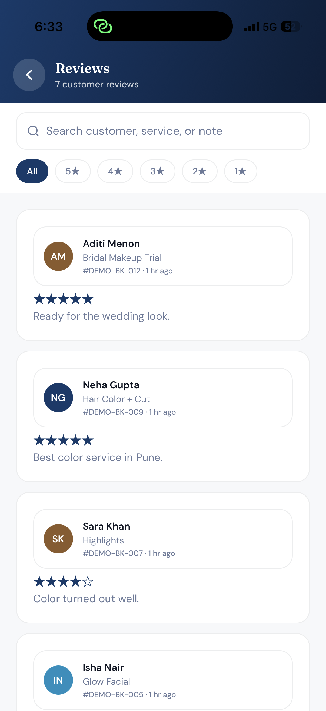

*Figure 26 — Reviews list tied to completed DEMO-BK bookings.*

### 5.3 Business intelligence (BI)

**What this module does**  
Turns recent booking history into operational insights. Managers/owners see tabs; some tabs may require Pro/trial entitlements.

**How each tab works**

| Tab | How to use it |
| --- | --- |
| **Overview** | Snapshot of bookings, est. revenue, completed/no-show/cancel rates, avg per day, and standout insights for the period |
| **Growth** | New vs returning customers, repeat rate, average visits, most active customers |
| **Revenue** | Estimated vs completed revenue and contribution by service (from list prices × bookings) |
| **Forecast** | Projects next-period bookings/revenue from recent history |
| **Reports** | Combined operations summary plus recent daily trend |

**How to navigate**

1. Open **More → Business intelligence** (or Reports).  
2. Switch tabs along the top.  
3. Change period controls when shown (screenshots use last 30 days).  
4. If a tab is locked, upgrade/renew from Products & plans.

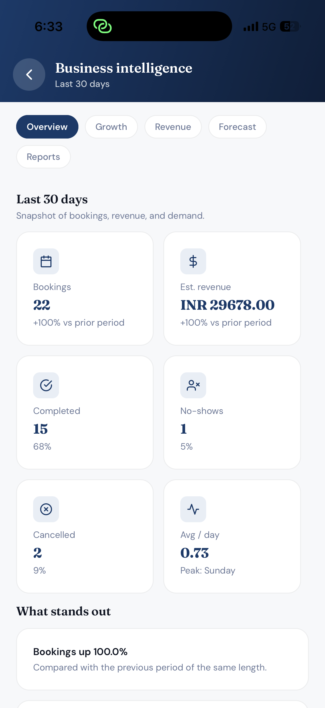

*Figure 27 — BI Overview snapshot.*

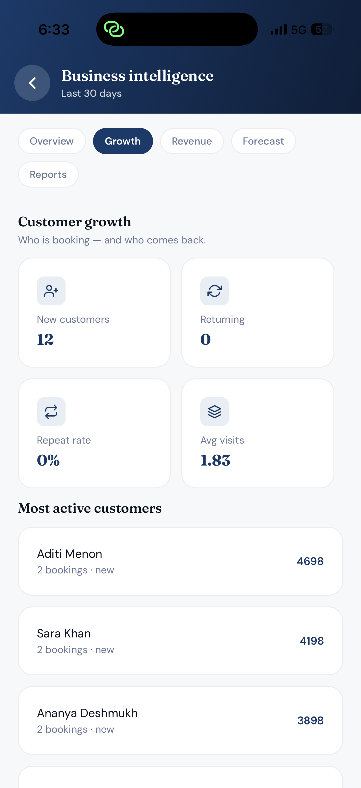

*Figure 28 — BI Growth and top customers.*

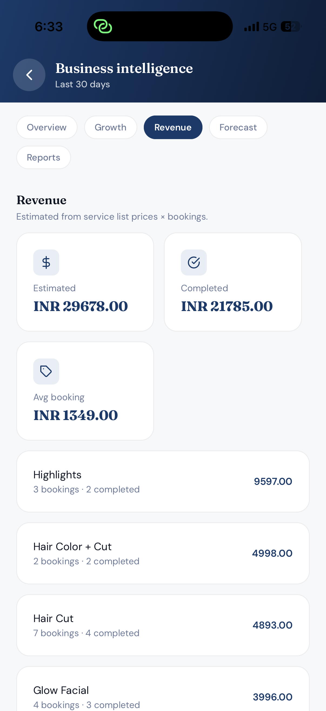

*Figure 29 — BI Revenue by service.*

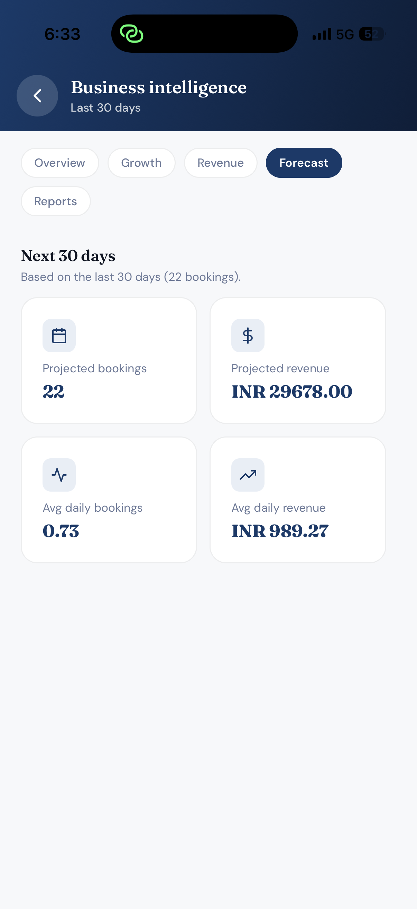

*Figure 30 — BI Forecast for the next period.*

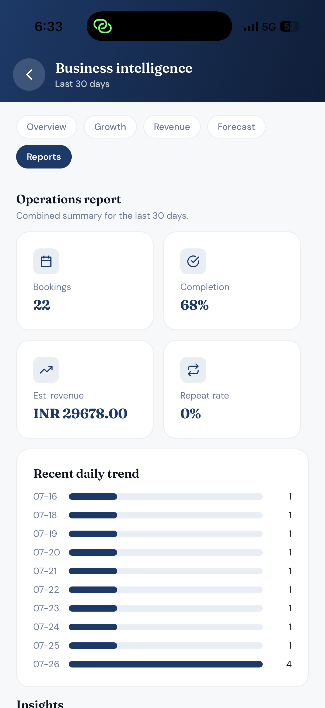

*Figure 31 — Operations report and daily trend.*

### 5.4 Offices

**What this screen does**  
Defines physical locations used when creating bookings.

**How it works**

1. Open **More → Offices** (or Settings → Offices).  
2. At least one office is required.  
3. Each office needs a complete address and map pin (lat/long).  
4. One office is **Primary** (used as default when relevant).  
5. Use **Add office** / **Set primary** within your plan’s office limit (trial/Pro allow more than Starter).

Demo Salon shows **Baner** and **Kalyani Nagar**.

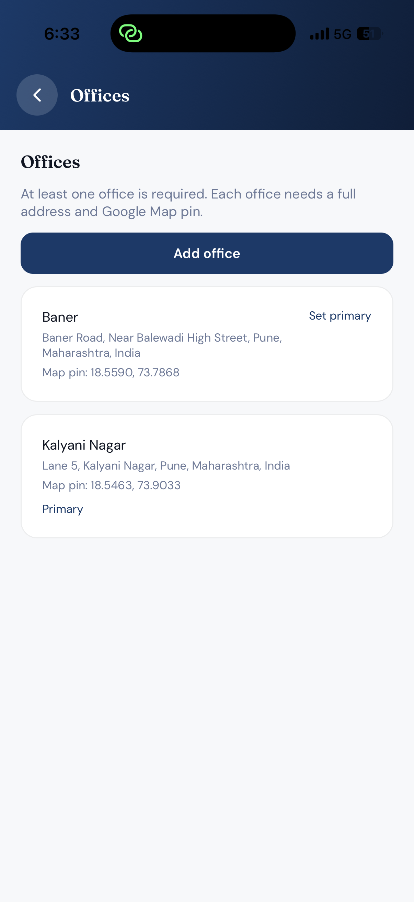

*Figure 32 — Offices list with addresses and map pins.*

### 5.5 Settings and Business Profile

**What Settings does**  
Central configuration hub for the workspace.

**How it works**

1. Open **More → Settings**.  
2. Choose:
   - **Business Profile** — identity and location  
   - **Products & plans** — subscription/billing/loyalty  
   - **Offices** — locations  
   - **Team & invitations** — access  

**Business Profile how it works**

1. View shows legal/display name, email, phone, address, product.  
2. **Edit business** lets you update branding (logo), names, contact, address, timezone, and currency.  
3. Save writes the profile used across OPS Mobile and customer-facing branding.

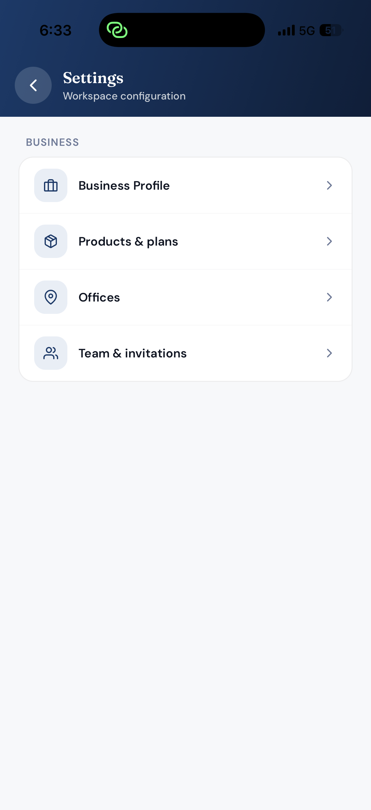

*Figure 33 — Settings hub.*

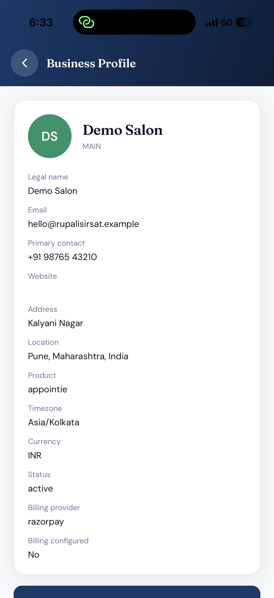

*Figure 34 — Business Profile read view.*

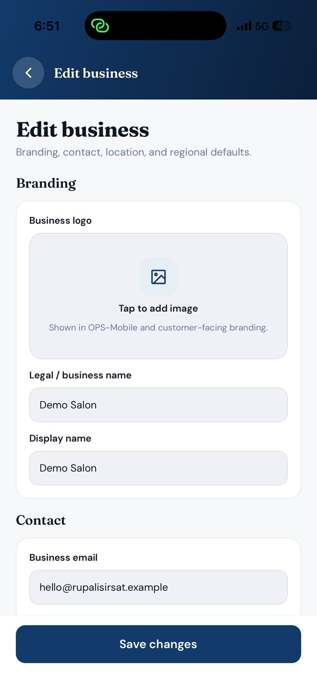

*Figure 35 — Edit business: branding, contact, location, regional defaults.*

### 5.6 Products, billing, and reward points

**What this screen does**  
Shows which product is active, which plan you are on, trial/period dates, seat usage, and loyalty configuration.

**How billing works**

1. Open **Settings → Products & plans**.  
2. **Active product** shows AppointIE and current status (e.g. trialing).  
3. Use **Change plan** / **Update plan** / **Unsubscribe** according to what your environment allows (local often uses mock Razorpay mode).  
4. **Plan & usage** shows staff seats used/max, offices used/max, monthly total, trial end, period start/end, renew date, and optional extra staff/offices add-ons.

**How reward points work**

1. Scroll to **Reward points** (plan-entitled / trial Pro features).  
2. Toggle **Enable for customers** to show the program in the customer app.  
3. Configure:
   - Points per currency unit (e.g. 10 pts = ₹1)  
   - Max redeem percent of service price  
   - Minimum redeem points  
4. Tap **Save reward points**.  
5. Customers then earn on completed services and can redeem on booking when the program is active.

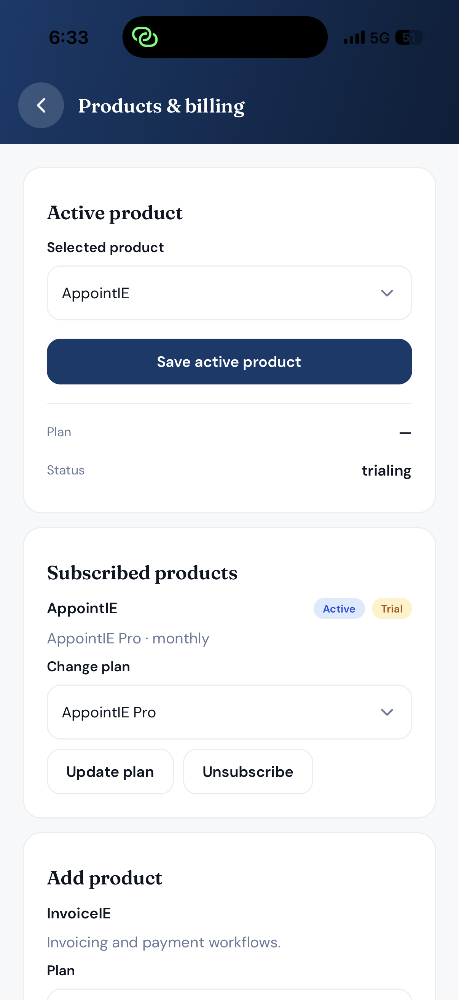

*Figure 36 — Active product and plan controls.*

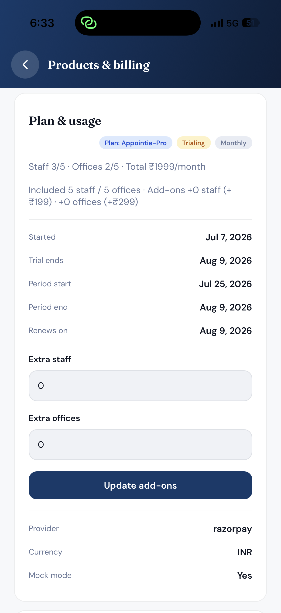

*Figure 37 — Plan usage, trial dates, and add-ons.*

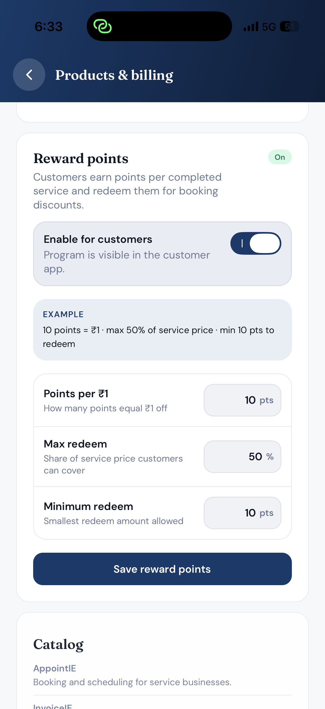

*Figure 38 — Reward points program configuration.*

### 5.7 Team and invitations

**What this screen does**  
Grants OPS-Mobile login access and shows who is linked.

**How it works**

1. Open **More → Team** (or Settings → Team & invitations).  
2. **Invite team member**
   - Enter email  
   - Choose **Staff** or **Manager**  
   - Send invitation  
3. Accepting an invite creates/links a staff profile and login.  
4. **Staff directory** shows operational profiles and whether login is linked.  
5. **Members with app access** lists users and roles; owners/managers can add/remove manager/staff roles (within rules).  
6. Pending invitations can be revoked when shown.

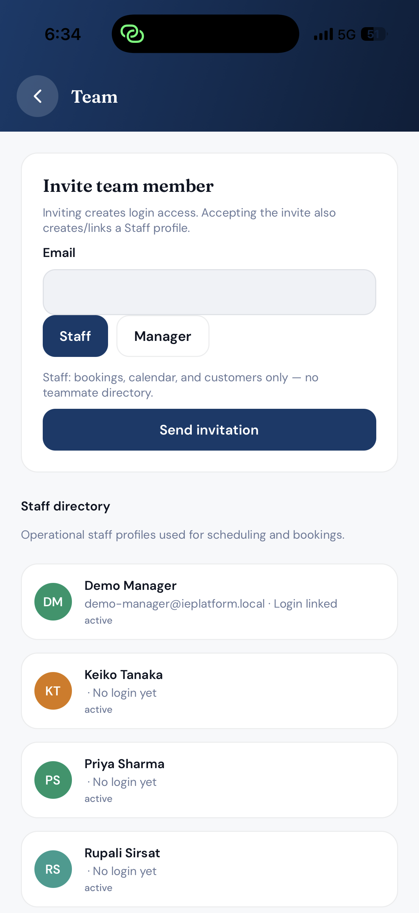

*Figure 39 — Invite form and staff directory.*

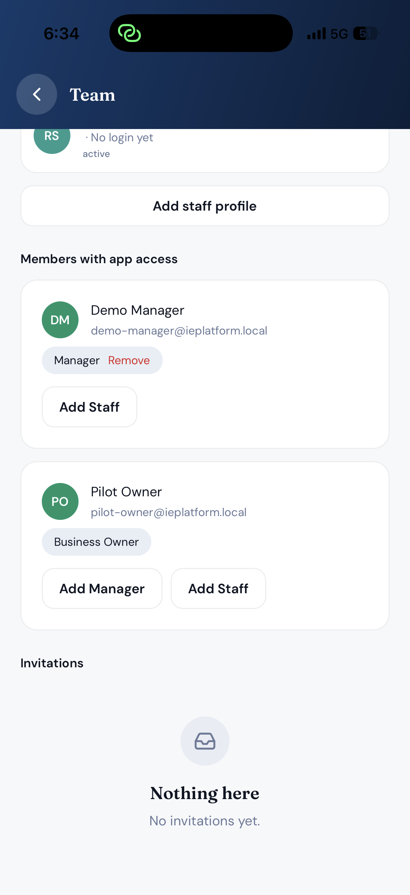

*Figure 40 — Members with app access and role controls.*

### 5.8 Profile / account

**What this screen does**  
Manages *your* login account (not the whole business profile).

**How it works**

1. Open **More → Profile** (or account entry).  
2. **Edit profile** — photo, name, phone, language, timezone.  
3. **Change password** — updates credentials (may disable biometrics until re-enabled).  
4. **Sessions** — review active sessions.  
5. **Face ID login** — enable/disable biometric unlock on this device.  
6. **Sign out** — ends the local session and returns to Sign in.

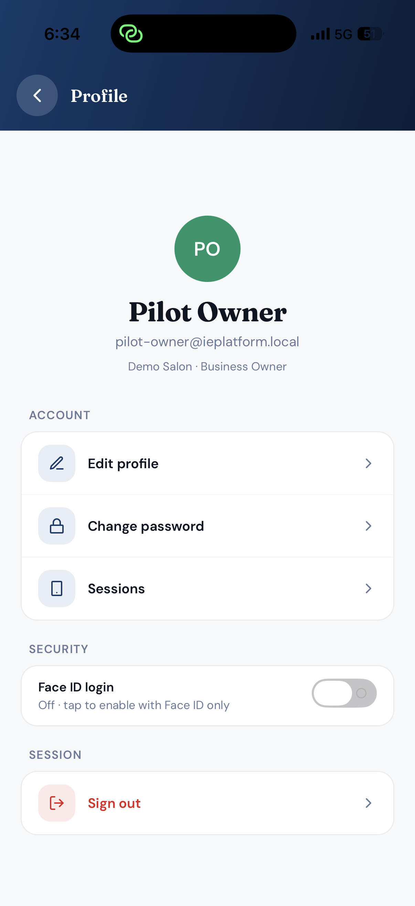

*Figure 41 — Profile and security options.*

---

## 6. How-to flows (end-to-end)

### 6.1 Create a booking

**Goal:** Put a customer on the schedule.

1. Go to **Bookings → New booking** (or Home → Booking).  
2. Select customer + service; pick office if prompted; choose staff or Any available.  
3. Select a day and an open slot.  
4. Add notes if needed → **Create booking**.  
5. Confirm detail opens and the card appears under Bookings/Calendar.

**If slots are empty:** check staff weekly schedule, leave, service duration, office, and business hours.

### 6.2 Run today’s appointment (confirm → check in → complete)

**Goal:** Move a visit from pending/confirmed to completed.

1. Open today’s booking from Bookings or Calendar.  
2. If status is pending, tap **Confirm**.  
3. When the customer arrives, tap **Check in**.  
4. When finished, tap **Complete**.  
5. If plans change, use **Reschedule** (new slot) or **Cancel booking** with a reason.

### 6.3 Add a customer and book them

1. **More → Customers → Add customer**.  
2. Enter identity + contact (+ optional address) → save.  
3. Open the new customer → **New booking**.  
4. Finish the create-booking steps; customer is already selected.

### 6.4 Update a service price/duration

1. **More → Services** → open the service.  
2. Edit duration/price (and image/description if needed).  
3. Save.  
4. New bookings use the updated values; verify on the services list.

### 6.5 Make a stylist bookable with hours and app access

1. **More → Staff** → open the person (or Add staff).  
2. Edit profile/contact.  
3. Turn **Available for bookings** on.  
4. Set role to **Staff** or **Manager**.  
5. Open weekly schedule; set working days and start/end times → Save.  
6. Optionally send invitation so they can log into OPS Mobile.

### 6.6 Invite a manager

1. **More → Team**.  
2. Enter email, choose **Manager**, send invitation.  
3. After they accept, confirm **Login linked** and Manager role under members.

### 6.7 Check plan limits and enable reward points

1. **Settings → Products & plans**.  
2. Review staff/office usage vs limits and trial/period end dates.  
3. Enable Reward points and set points-per-currency, max redeem %, min redeem.  
4. Save. Customers can then earn/redeem according to those rules.

### 6.8 Review performance in BI

1. **More → Business intelligence**.  
2. Start on **Overview** for the period snapshot.  
3. Use **Growth** for retention, **Revenue** for service mix, **Forecast** for outlook, **Reports** for the combined ops view.

---

## 7. Troubleshooting

| Problem | How it works / what to do |
| --- | --- |
| Sign-in fails | Check email/password; use Forgot password; confirm account is active |
| No open slots | Ensure service selected; staff is bookable and scheduled; not on leave; office selected |
| Staff missing from picker | Enable **Available for bookings**; confirm employment is active |
| Cannot open Settings/BI | Signed in as Staff role — need Manager/Owner |
| Cannot add office/staff | Plan limit or soft lock — check Products & plans |
| Places address not suggesting | Set `EXPO_PUBLIC_GOOGLE_PLACES_API_KEY` in repo-root `.env` and reload the app |
| Soft-lock banner | Trial/period ended — renew or change plan under Products & plans |
| Alerts empty | No notification events yet, or wrong workspace; create/cancel bookings to generate events in demo |

---

## 8. Related documents

- [IE-0005 Functional Requirements Specification](IE-0005-Functional-Requirements-Specification-FRS.md)  
- [IE-0005.01 Customer Mobile App Functional Specification](IE-0005.01-Customer-Mobile-App-Functional-Specification.md)  
- [IE-0005.02 Business Dashboard Functional Specification](IE-0005.02-Business-Dashboard-Functional-Specification.md)  
- [AppointIE product folder](README.md)  
- Word edition: [IE-0005.04-OPS-Mobile-App-User-Guide.docx](IE-0005.04-OPS-Mobile-App-User-Guide.docx)

## 9. Optional later captures

- Register wizard steps 2–4  
- Accept invitation  
- Workspace picker  

---

*End of IE-0005.04 OPS Mobile App User Guide.*
