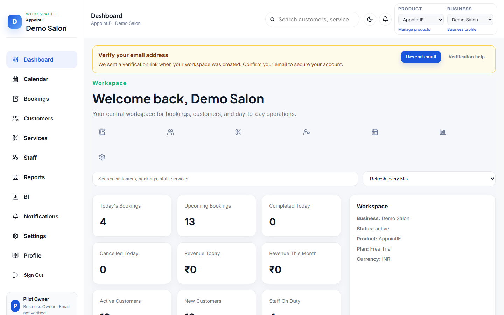
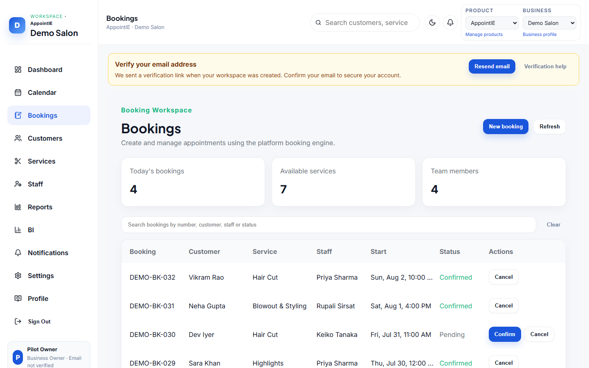
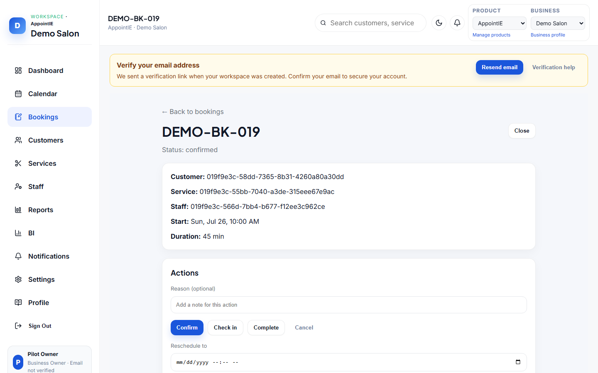
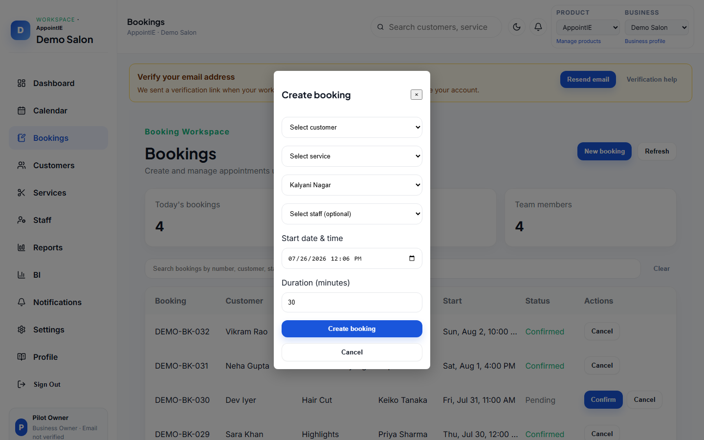

# AppointIE Business Dashboard User Guide  
## Sample Preview (≈ 5 pages)

> **This is a sample only.**  
> It shows the format, tone, and screenshot layout we will use for the full `IE-0005.03` guide.  
> Every screen below explains **what it does** and **how it works** (not only a title + image).  
> Screenshots are **real captures** from the seeded Demo Salon workspace (local web app).  
> Images live next to this file in `./images/`. Open this file with **Markdown Preview** (`Ctrl+Shift+V`) to see them.

**Audience:** Business owners and managers  
**Surface:** AppointIE web dashboard (`/dashboard`, `/bookings`, …)  
**Demo login (local):** `pilot-owner@ieplatform.local` / `PilotPass123!`  
**Workspace:** Demo Salon (`demo` / `MAIN`)

---

## Page 1 — Overview

### What this guide covers

The Business Dashboard is where your team runs day-to-day AppointIE operations: appointments, customers, services, staff, reporting, and business settings.

This guide has two parts:

| Part | Purpose |
| --- | --- |
| **Feature catalog** | Screen-by-screen: what you see and how each control works |
| **How-to flows** | Task recipes: step-by-step with screenshots |

### Who can use what

| Role | Typical access |
| --- | --- |
| Business owner | Full access (operations + settings + billing + team) |
| Manager | Operations + most settings (depends on permissions) |
| Staff | Limited to assigned bookings and allowed modules |

### App shell — how it works

After sign-in you always work inside the same shell:

1. **Left navigation** — switches modules (Dashboard, Calendar, Bookings, Customers, Services, Staff, Reports, BI, Notifications, Settings, Profile). The active item stays highlighted so you always know where you are.  
2. **Top bar** — shows the current workspace (Demo Salon) and account menu. If you belong to more than one business, use the workspace picker here before trusting any list or KPI.  
3. **Main content** — loads the selected module. Changing nav items does not sign you out; it only swaps this pane.  
4. Soft-lock / plan banners (when shown) appear above the content and block create/add actions until you renew or change plan under **Settings → Products**.


*Figure 1 — App shell: Demo Salon workspace with Dashboard selected.*

---

## Page 2 — Feature catalog: Dashboard

### What this screen does

The Dashboard is your daily home screen. It pulls live booking, customer, staff, and notification data for the **active workspace** so you can see today’s load and jump into common tasks without hunting through menus.

### How it works

1. Open **Dashboard** in the left nav (default after sign-in).  
2. Confirm the welcome header shows the correct business name (example: *Demo Salon*). If it does not, switch workspace from the account/workspace picker.  
3. Use the **quick-action icons** under the welcome text to jump straight to create/booking or related modules (same destinations as the left nav, but one click).  
4. Type in the search field to find **customers, bookings, staff, or services**. Results appear in the Search results widget; click a hit to open that record.  
5. Optionally set **auto-refresh** (Manual, or every N seconds). When an interval is set, KPI tiles and widgets re-fetch without a full page reload.  
6. Read the **KPI tiles** — they are calculated from today’s bookings and related lists, for example:
   - Today’s / Upcoming / Completed / Cancelled bookings  
   - Revenue today and this month  
   - Active / new customers, staff on duty, occupancy  
7. Use **Today’s Schedule** to see the next appointments for the current day. Click a row (or open Bookings) when you need to confirm, cancel, or edit.  
8. Use **Notification Center** for unread business alerts; open **Notifications** in the nav when the unread count is high.  
9. Scan **Recent Activity**, **Calendar Preview**, and **Business Summary** for a short trail of what changed and a week-ahead hint.  
10. If a **Getting started** checklist appears for a new workspace, complete or dismiss it — dismissing stores a local preference so it does not keep blocking the view.

### Main regions (quick map)

| Region | What it shows / does |
| --- | --- |
| Welcome + quick actions | Workspace greeting and one-click shortcuts |
| Search + refresh | Find records; choose how often data reloads |
| KPI tiles | Counts and revenue derived from live lists |
| Today’s Schedule | Next appointments for today |
| Notification Center | Latest alerts with unread highlighting |
| Recent Activity / Calendar Preview / Business Summary | Supporting context for the day |

### Permissions

Requires at least `business:read`. Some quick actions also need write permissions (for example `booking:write`).



*Figure 2 — Dashboard home with seeded KPIs (today’s bookings, customers, staff, and plan status).*

### Tips

- If tiles look empty, confirm your workspace has services, staff, and bookings (use the dashboard demo seed in local environments).  
- Switch workspace from the account / workspace picker if you manage more than one business.  
- Soft-lock banners mean create actions may fail until the plan is renewed — viewing usually still works.

---

## Page 3 — Feature catalog: Bookings

### What this screen does

Bookings is the operations list for appointments. It is where you search the queue, confirm or cancel from the row, open a detail page, or create a new appointment through the booking engine.

### How it works

1. Open **Bookings** in the left nav.  
2. Use the search box to filter by booking number, customer name, staff name, or status (example terms: `DEMO-BK`, `Ananya`, `pending`).  
3. Read each table row: date/time, customer, service, staff, status, and available actions.  
4. **Confirm** appears only when status is `pending` or `draft`. Clicking it accepts the appointment onto the schedule; the status updates without leaving the list.  
5. **Cancel** appears when the booking is not already `cancelled` or `completed`. Cancelling removes it from the active schedule (a reason may be stored depending on the dialog).  
6. Click the booking (or detail affordance) to open the **booking detail** page for full information — service, customer, staff, timing, notes, and further lifecycle actions when available.  
7. Click **Create booking** to open the create dialog (see Page 4).  
8. After create / confirm / cancel, the list refreshes so the new status is visible immediately.

### Statuses you will see

| Status | Meaning | Typical next action |
| --- | --- | --- |
| `pending` | Waiting for confirmation | Confirm or Cancel |
| `confirmed` | Accepted and on the schedule | Open detail / Cancel if needed |
| `checked_in` | Customer has arrived | Complete from detail (when available) |
| `completed` | Service finished | View only |
| `cancelled` | Cancelled | View only |
| `no_show` | Customer did not attend | View only |

### Main regions

| Region | What it shows / does |
| --- | --- |
| Page header | Title and primary **Create booking** action |
| Search | Filters the table client-side by key fields |
| Bookings table | Operational queue with inline Confirm / Cancel |
| Detail page | Full appointment record after you open a row |
| Create dialog | Form to pick customer, service, staff, office, and start time |

### Permissions

Requires `booking:read`. Create / confirm / cancel need `booking:write` or `booking:manage`.



*Figure 3 — Bookings list showing seeded `DEMO-BK-*` appointments with Confirm / Cancel actions.*



*Figure 4 — Booking detail for a seeded Demo Salon appointment. Use this page when the list row is not enough (notes, full timing, related history).*

---

## Page 4 — How-to: Create a booking

### Goal

Create a new appointment for an existing customer and see it appear on the Bookings list (and Calendar for that date).

### Prerequisites

- You are signed in as a user with booking write access  
- At least one **customer**, **service**, **staff**, and **office** exist  
- Demo Salon seed already provides these  
- Soft-lock is not blocking create actions

### How it works (steps)

1. In the left nav, open **Bookings**.  
2. Click **Create booking** (primary button in the header).  
3. In the dialog, select:
   - **Customer** (example: *Ananya Deshmukh*) — who the appointment is for  
   - **Service** (example: *Hair Cut*) — sets duration and price context for the slot  
   - **Staff** (example: *Rupali Sirsat*) — who will deliver the service; must be active/bookable  
   - **Office / branch** (example: *Kalyani Nagar*) — location for multi-office workspaces  
   - **Start date and time** — must fall inside business hours / staff availability  
4. Submit with **Create booking**.  
5. Wait for the success state (the button may show “Creating booking…” while the API runs).  
6. Confirm the new row appears in the list with status `pending` or `confirmed` (depending on flow), and that it also shows under **Calendar** for that date.



*Figure 5 — Create booking dialog: pick customer, service, office, staff, and start time, then submit.*

### Expected result

- A new booking appears in the Bookings list  
- It also appears on **Calendar** for that date  
- The customer’s history reflects the new appointment  
- Dashboard KPIs / Today’s Schedule update on the next refresh

### If something fails

| Problem | What to check |
| --- | --- |
| No staff in the dropdown | Staff must be active and bookable; check **Staff** |
| No offices listed | Add an office under **Settings → Business** (Branches/Offices) |
| Time rejected | Pick a slot inside business hours / staff availability |
| Soft-lock banner | Trial/plan period ended — renew from **Settings → Products** |
| Create stays pending / errors | Confirm network/API is up; retry after the previous request finishes |

---

## Page 5 — How the full guide will look

### Final document outline (not in this sample)

```text
IE-0005.03 Business Dashboard User Guide
├── 1. Overview & roles
├── 2. Getting started (sign-in, workspace, shell)
├── 3. Feature catalog
│   ├── Dashboard ← (sample pages 1–2)
│   ├── Calendar
│   ├── Bookings ← (sample page 3)
│   ├── Customers / Services / Staff
│   ├── Reports & BI
│   ├── Notifications
│   ├── Settings
│   └── Profile
├── 4. How-to flows
│   ├── Create a booking ← (sample page 4)
│   ├── Add / update a customer
│   ├── Create / edit a service
│   ├── Add staff & manage team
│   ├── Work the calendar day
│   ├── Update business profile
│   ├── Review billing / products
│   └── Read reports & BI
└── 5. Glossary & related docs
```

### Screenshot conventions (final guide)

| Rule | Detail |
| --- | --- |
| Format | PNG |
| Folder | `assets/images/appointie/web-ops/` |
| Naming | `web-ops-<area>-<screen>.png` (e.g. `web-ops-bookings-list.png`) |
| Viewport | Desktop ≈ 1280–1440px wide |
| Data | Captured from Demo Salon only (fictional customers) |
| Caption | Every image has a short *Figure N — …* line |
| Prose | Every screen has **What this screen does** + **How it works** (numbered steps) |

### What changes from this sample to the real guide

1. Same screenshot style, but for **all** modules (not just Dashboard + Bookings)  
2. Every module gets a catalog section like Dashboard / Bookings, with how-it-works steps  
3. Every major task gets a how-to like “Create a booking”  
4. Document ID becomes official `IE-0005.03` (this file stays a SAMPLE)  
5. Linked from the AppointIE README document index  

---

## Related documents

- [Business Dashboard Functional Specification (IE-0005.02)](IE-0005.02-Business-Dashboard-Functional-Specification.md)  
- [AppointIE product folder](README.md)

---

*End of sample preview. No further pages in this file.*
