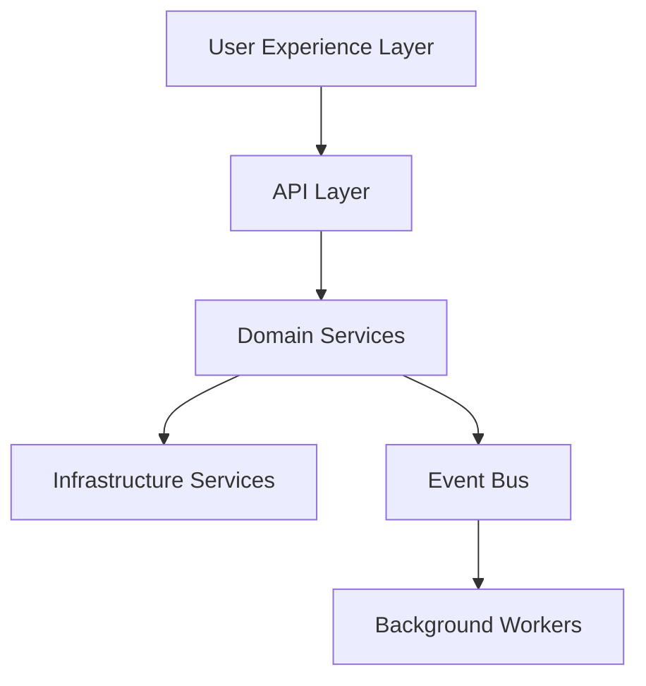

# AI Architecture Standard

## Revision History

| Version | Date | Author | Summary |
| --- | --- | --- | --- |
| 1.0.0 | 2026-07-04 | Solution Architecture | Initial architecture standard for the IE Platform |

## Table of Contents

1. Purpose
2. Platform Principles
3. Domain-Driven Design
4. Multi-Tenant Design
5. White Label Design
6. Event-Driven Design
7. Core Engines
8. Shared Component Library
9. Monorepo Standards
10. API-First Architecture
11. Cloud-Native Principles
12. Future Product Strategy
13. Architecture Decision Records
14. Architecture Review Checklist
15. Anti-Patterns
16. Things Never Allowed

## 1. Purpose

This standard protects the long-term architectural integrity of the IE Platform. It defines boundaries, patterns, and non-negotiable rules for how the platform is structured, evolved, and operated.

## 2. Platform Principles

- Platform first: build capabilities once and reuse them broadly.
- Multi-tenant by design: isolate tenant data, configuration, and behavior.
- API first: expose capabilities through stable contracts.
- White label ready: support tenant-specific branding and behavior.
- Event driven: use decoupled workflows to improve resilience and scalability.
- Cloud native: run in a portable, observable, automated environment.
- Modular: keep domains and services cohesive and replaceable.

## 3. Domain-Driven Design

The platform must be organized around business domains rather than technical convenience. Core domains include:

- Booking Engine
- Availability Engine
- Workflow Engine
- Notification Engine
- Analytics Engine
- Audit Engine
- Scheduler Engine
- Integration Engine
- Configuration Engine
- AI Engine



## 4. Multi-Tenant Design

All shared services must support tenant-aware execution. Tenant boundaries must apply to:

- Data access
- Configuration
- Policy and permissions
- Rate limits
- Feature flags
- Branding and UI assets

## 5. White Label Design

White-label behavior must be modeled as configuration-driven rather than hardcoded. Shared services should support custom themes, localized content, legal terms, business rules, and market-specific workflow changes without branching the platform core.

## 6. Event-Driven Design

Use events for decoupled interactions where real-time coupling is unnecessary. Examples include booking created, availability changed, reminder triggered, workflow completed, and audit event emitted.

## 7. Core Engines

### Booking Engine
Responsible for the lifecycle of reservations, scheduling, and booking state changes.

### Availability Engine
Responsible for opening, closing, and calculating service availability.

### Workflow Engine
Responsible for orchestrating steps, approvals, transitions, and business automation.

### Notification Engine
Responsible for outbound communications such as email, SMS, reminders, and alerts.

### Analytics Engine
Responsible for operational, product, and customer insights.

### Audit Engine
Responsible for immutable and reviewable logs of changes and actions.

### Scheduler Engine
Responsible for timed workflows, recurring jobs, reminders, and maintenance tasks.

### Integration Engine
Responsible for external connectors and third-party adapters.

### Configuration Engine
Responsible for tenant-specific and environment-specific runtime configuration.

### AI Engine
Responsible for model orchestration, prompt execution, retrieval, evaluation, and governance.

## 8. Shared Component Library

A shared UI and integration component library must be maintained for consistent experience and reuse. Shared components must be designed for extensibility and theming rather than one-off implementation.

## 9. Monorepo Standards

Where applicable, the platform should use a monorepo structure that keeps cross-cutting concerns and shared libraries coordinated. This must be paired with clear service boundaries, dependency governance, and release discipline.

## 10. API-First Architecture

All major capabilities must be reachable through stable, documented APIs. Internal services should communicate through well-defined contracts rather than direct dependency coupling.

## 11. Cloud-Native Principles

- Containerized deployment
- Environment parity
- Observability and tracing
- Infrastructure as code
- Automated recovery and scaling
- Configuration-driven release behavior

## 12. Future Product Strategy

Architecture must be designed not only for AppointIE but also for future products in travel, services, commerce, logistics, and AI-assisted operations. Avoid product-specific assumptions in the core platform layers.

## 13. Architecture Decision Records

Every significant architectural decision must be captured in an ADR. ADRs should include:

- Context
- Decision
- Rationale
- Consequences
- Alternatives considered

## 14. Architecture Review Checklist

Before approving a significant design, review:

- Domain boundaries and ownership
- Tenant isolation
- API contract clarity
- Event flow and failure handling
- Security obligations
- White-label compatibility
- Observability and operational readiness
- Long-term maintainability

## 15. Anti-Patterns

The following are prohibited or discouraged:

- Hardcoded tenant or brand behavior in shared services
- Tight coupling between UI and domain logic
- Hidden database writes inside view layers
- Synchronous cross-service calls where async decoupling is preferable
- Business logic embedded in infrastructure code
- Unreviewed dependency growth

## 16. Things Never Allowed

- Breaking tenant isolation
- Mixing multi-tenant configuration with service-level constants
- Reintroducing duplicate business logic across products
- Shipping architecture that cannot be reviewed or tested
- Ignoring security and observability requirements

## Glossary

- ADR: Architecture Decision Record
- Domain boundary: A deliberate separation of responsibilities between business areas

## References

- [AI System Prompt](AI_SYSTEM_PROMPT.md)
- [AI Coding Standard](AI_CODING_STANDARD.md)
- [IE Platform Master Index](IE-PLATFORM-MASTER-INDEX.md)

## Appendix A: Architectural Review Template

```text
Review the proposed design for domain clarity, multi-tenant safety, white-label compatibility, API contract stability, operational readiness, and long-term maintainability.
```
