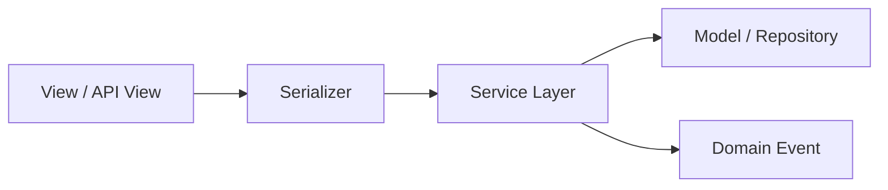

# AI Coding Standard

## Revision History

| Version | Date | Author | Summary |
| --- | --- | --- | --- |
| 1.0.0 | 2026-07-04 | Engineering Excellence | Initial coding standard for the IE Platform |

## Table of Contents

1. Scope
2. Python
3. Django and Django REST Framework
4. React
5. React Native
6. TypeScript and JavaScript
7. PostgreSQL
8. Redis
9. Celery
10. Docker
11. Naming
12. Folder Structure
13. Repository Pattern
14. Service Layer
15. Testing
16. Comments
17. Logging
18. Error Handling and Exceptions
19. Configuration and Environment Variables
20. Performance
21. Security
22. Code Review
23. SOLID and Clean Architecture
24. Design Patterns
25. Dependency Injection
26. Future AI Coding

## 1. Scope

This standard applies to all software changes made for the IE Platform, including backend services, APIs, web interfaces, mobile applications, automation workers, and shared libraries. It defines how engineering work should be implemented, reviewed, and maintained.

## 2. Python

- Use Python 3.11+.
- Favor explicit, typed, and well-documented code.
- Keep modules focused and avoid mixed responsibilities.
- Use dataclasses, enums, and typed dictionaries where appropriate.
- Prefer standard library solutions before introducing heavy dependencies.

## 3. Django and Django REST Framework

- Use Django as the application framework and DRF for API surfacing.
- Keep serializers focused on validation and transformation.
- Put business logic in services or domain modules, not inside views.
- Use permissions and policies explicitly for authorization.
- Use queryset filtering and scoping carefully to preserve tenant isolation.



## 4. React

- Use functional components and hooks.
- Keep components small and composable.
- Separate UI state from domain state.
- Use typed props and well-defined interfaces.
- Reuse common components from the shared component library.

## 5. React Native

- Keep cross-platform logic shared wherever possible.
- Isolate platform-specific code cleanly.
- Handle device constraints and connectivity explicitly.
- Avoid duplicating business rules in screens.

## 6. TypeScript and JavaScript

- Prefer TypeScript for new frontend code.
- Use strict typing and avoid implicit any.
- Favor immutable data structures and pure functions.
- Keep side effects at the edges of the application.

## 7. PostgreSQL

- Use PostgreSQL as the transactional system of record.
- Use migrations for schema evolution.
- Create indexes only when justified by usage patterns.
- Keep domain constraints and validations close to the data layer.

## 8. Redis

- Use Redis for transient state, caching, queues, and fast lookups.
- Avoid overusing Redis as a primary data store.
- Document cache keys and invalidation strategies clearly.

## 9. Celery

- Use Celery for asynchronous work, scheduling, and integration jobs.
- Keep tasks idempotent where possible.
- Log task outcomes and support retries with clear backoff strategies.

## 10. Docker

- Use Docker for reproducible local and CI environments.
- Keep images minimal and clear in purpose.
- Separate app, worker, and database runtime concerns.

## 11. Naming

- Use descriptive, unambiguous names.
- Prefer domain-driven names over generic ones.
- Use lower_snake_case for Python modules and variables.
- Use PascalCase for React components and TypeScript types.
- Use camelCase for JavaScript and TypeScript properties.

## 12. Folder Structure

Use a consistent structure such as:

```text
src/
  domain/
  application/
  infrastructure/
  interfaces/
  shared/
  tests/
```

## 13. Repository Pattern

Use repositories only where they clarify persistence boundaries. Prefer small, domain-focused repository abstractions over a generic data-access layer that hides business behavior.

## 14. Service Layer

Implement business operations in a service layer that coordinates validation, domain rules, persistence, and events. Avoid placing core business logic directly in views, handlers, or UI components.

## 15. Testing

- Write unit tests for domain rules and services.
- Write integration tests for APIs, persistence, and workflow coordination.
- Write end-to-end tests for critical user journeys.
- Keep tests fast, deterministic, and meaningful.

## 16. Comments

Comments should explain why, not what. Prefer code that is self-explanatory and use comments only when context is not obvious.

## 17. Logging

- Log meaningful business and operational events.
- Include correlation IDs and contextual metadata.
- Avoid logging secrets or sensitive personal data.
- Use structured logging where possible.

## 18. Error Handling and Exceptions

- Handle expected errors explicitly.
- Use custom domain exceptions for business errors.
- Translate infrastructure failures into structured application errors.
- Never swallow exceptions silently.

## 19. Configuration and Environment Variables

- Store configuration in environment variables or secret management systems.
- Keep defaults explicit and documented.
- Never embed secrets in code or configuration files committed to the repository.

## 20. Performance

- Measure before optimizing.
- Avoid N+1 query patterns and repeated expensive I/O.
- Use pagination and filtering for large datasets.
- Cache only when the gain is clear and safe.

## 21. Security

- Validate all input.
- Sanitize outputs and escape untrusted content.
- Enforce authentication and authorization at the boundary.
- Use parameterized queries and safe ORM patterns.
- Handle tenant and role data with strict access control.

## 22. Code Review

Every change should be reviewed for:

- Correctness
- Security
- Scalability
- Maintainability
- Test coverage
- Documentation impact

## 23. SOLID and Clean Architecture

- Single responsibility: one reason to change.
- Open/closed: extend through abstractions, not modification.
- Liskov substitution: implementations must honor contracts.
- Interface segregation: expose only what consumers need.
- Dependency inversion: depend on abstractions rather than concrete implementations.

## 24. Design Patterns

Use patterns when they improve clarity and avoid over-engineering. Common patterns that are acceptable include:

- Repository
- Strategy
- Factory
- Observer
- Adapter
- Command

## 25. Dependency Injection

Prefer constructor injection and explicit dependencies over hidden global state. This makes the system easier to test and evolve.

## 26. Future AI Coding

AI-assisted coding must remain aligned with the architecture. Any generated change should respect domain boundaries, include tests, and preserve maintainability. The assistant should not optimize for short-term convenience at the expense of long-term platform quality.

## Glossary

- Service layer: A module that coordinates business operations and infrastructure concerns.
- Repository: An abstraction over persistence that isolates domain code from storage mechanics.

## References

- [AI System Prompt](AI_SYSTEM_PROMPT.md)
- [AI Documentation Standard](AI_DOCUMENTATION_STANDARD.md)
- [AI Architecture Standard](AI_ARCHITECTURE_STANDARD.md)

## Appendix A: Implementation Checklist

- [ ] Domain boundaries are clear
- [ ] Tests added or updated
- [ ] Documentation updated if behavior changed
- [ ] Security considerations reviewed
- [ ] Performance concerns evaluated
