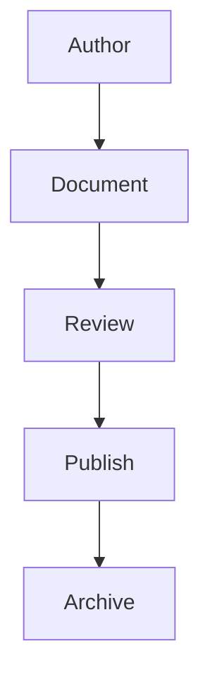
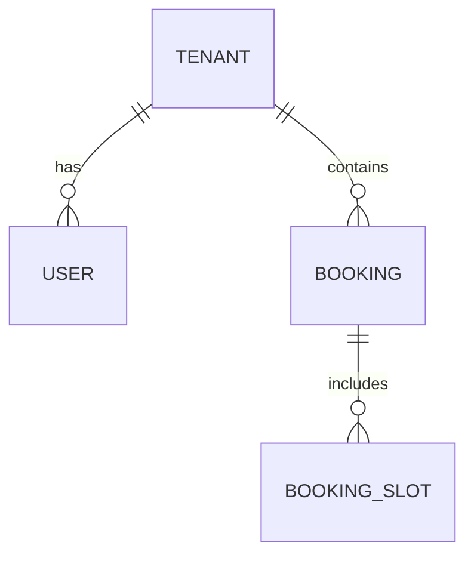

# AI Documentation Standard

## Revision History

| Version | Date | Author | Summary |
| --- | --- | --- | --- |
| 1.0.0 | 2026-07-04 | Documentation Guild | Initial documentation standard for the IE Platform |

## Table of Contents

1. Purpose
2. Folder Structure
3. Document Numbering
4. Naming Conventions
5. Markdown Standards
6. Mermaid Standards
7. Front Matter
8. Metadata
9. Revision History
10. Tables
11. Cross References
12. Architecture Diagrams
13. ER Diagrams
14. API Documentation
15. Glossary
16. Templates
17. Examples
18. Quality Checklist

## 1. Purpose

Documentation is a product asset. It must be clear, maintainable, reviewable, and aligned with the architectural and engineering standards of the IE Platform. All major documents must be searchable, versioned, and connected to each other through explicit references.

## 2. Folder Structure

The documentation repository must follow a stable structure:

```text
docs/
  index.md
  00-governance/
  01-platform/
  02-architecture/
  03-database/
  04-api/
  05-design/
  06-products/
  07-development/
  08-security/
  09-devops/
  10-testing/
  11-ai/
  12-white-label/
  13-integrations/
  14-roadmap/
  15-decisions/
  appendices/
templates/
assets/
```

## 3. Document Numbering

Use the following prefix conventions:

- IE-#### for enterprise documentation
- ADR-### for architecture decisions
- API-### for API specifications
- DB-### for database specifications
- SCR-### for screen specifications
- TC-### for test cases
- REL-### for release notes
- AI-### for AI artifacts
- WL-### for white-label documents

## 4. Naming Conventions

- Use lowercase directory names for sections.
- Use descriptive, title-cased filenames for documents.
- Use a consistent ID prefix in the front matter and filename where applicable.
- Use hyphenated slugs for file names and URLs.

## 5. Markdown Standards

- Use valid Markdown with heading hierarchy that begins at H1.
- Keep paragraphs concise and factual.
- Use bullet lists for grouped items and numbered lists for procedural steps.
- Use tables for structured data and comparison information.
- Use callouts and admonitions sparingly and consistently.
- Avoid placeholder language such as TBD or To be completed.

## 6. Mermaid Standards

Use Mermaid diagrams when visualizing flows, architecture, process, state, or relationships.



Rules:

- Keep diagrams readable and focused on one concept.
- Use consistent node naming and simple labels.
- Prefer flowcharts or sequence diagrams for architecture and process documentation.

## 7. Front Matter

Every significant document must include front matter:

```yaml
---
document_id: IE-AI-002
title: AI Documentation Standard
version: 1.0.0
status: Active
owner: Documentation Guild
review_date: 2026-07-04
last_updated: 2026-07-04
related_documents:
  - IE-AI-001
---
```

## 8. Metadata

Each document should record:

- Document ID
- Title
- Version
- Status
- Owner
- Review date
- Last updated date
- Related documents

## 9. Revision History

Every document must include a revision history table.

## 10. Tables

Use tables for:

- Status tracking
- Dependencies and owners
- API parameters and responses
- Database schema and fields
- Roadmap milestones and deliverables

## 11. Cross References

Cross references must be explicit. When a document depends on another, include a link to it in the related documents section and in body text where appropriate.

## 12. Architecture Diagrams

Architecture documentation must use diagrams to describe boundaries, services, persistence, event flows, and external dependencies. Diagrams should be reviewed with the architecture team before publication.

## 13. ER Diagrams

Database and domain documentation should include ER diagrams where relationships matter. Use Mermaid ER syntax where practical.



## 14. API Documentation

API documentation must include:

- Endpoint summary
- HTTP method and path
- Authentication requirements
- Request and response shapes
- Error cases
- Versioning notes
- Example payloads

## 15. Glossary

Each major document should include a compact glossary for domain-specific terms to reduce ambiguity.

## 16. Templates

Use templates from the templates directory for consistent output:

- ADR
- PRD
- FRS
- Database table definition
- API specification
- Screen specification
- Component specification
- Test case
- Release note

## 17. Examples

### Example Document Structure

1. Front matter
2. Title and summary
3. Revision history
4. Table of contents
5. Main content
6. Glossary
7. References
8. Appendices if needed

## 18. Quality Checklist

A document is ready for publication when:

- The front matter is complete.
- The content is accurate and current.
- The review owner is identified.
- Cross references are present.
- The structure is consistent with the repository standard.
- Mermaid or tables are used where helpful.
- The document has been reviewed by the appropriate owner.

## References

- [AI System Prompt](AI_SYSTEM_PROMPT.md)
- [AI Coding Standard](AI_CODING_STANDARD.md)
- [AI Architecture Standard](AI_ARCHITECTURE_STANDARD.md)
- [IE Platform Master Index](IE-PLATFORM-MASTER-INDEX.md)

## Appendix A: Documentation Review Checklist

- [ ] Document ID assigned
- [ ] Owner assigned
- [ ] Revision history present
- [ ] Cross references added
- [ ] Diagrams or tables included where appropriate
- [ ] Consistent voice and structure applied
