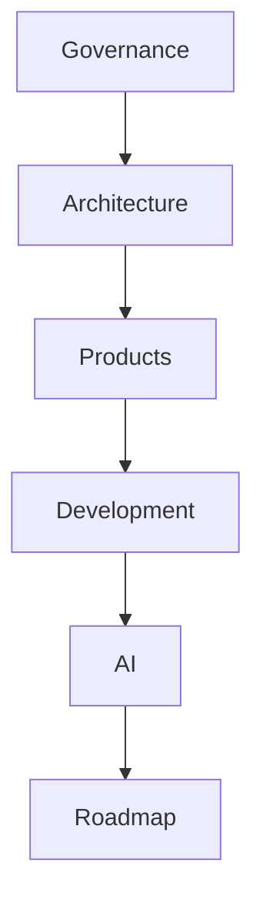

# IE Platform Master Index

## Revision History

| Version | Date | Author | Summary |
| --- | --- | --- | --- |
| 1.0.0 | 2026-07-04 | Documentation Guild | Initial master index for IE Platform engineering standards |

## Table of Contents

1. Governance
2. Architecture
3. Database
4. Products
5. Development
6. Security
7. Testing
8. API
9. DevOps
10. AI
11. Roadmap
12. White Label
13. Future Products

## Governance

| Document ID | Title | Status | Owner | Priority |
| --- | --- | --- | --- | --- |
| IE-0001 | IE Platform Documentation Repository | Active | Documentation Guild | High |
| IE-0002 | Contributing to IE Platform Documentation | Active | Documentation Guild | High |
| IE-0003 | Changelog | Active | Documentation Guild | Medium |
| IE-0004 | License | Active | IE Platform Team | Medium |
| IE-0005 | Code of Conduct | Active | Community Leadership | Medium |
| IE-0006 | Security Policy | Active | Security Team | High |

## Architecture

| Document ID | Title | Status | Owner | Priority |
| --- | --- | --- | --- | --- |
| IE-0012 | Architecture | Active | Solution Architecture | High |
| ADR-001 | Architecture Decision Record Template | Draft | Solution Architecture | High |
| IE-AI-004 | AI Architecture Standard | Active | Solution Architecture | High |

## Database

| Document ID | Title | Status | Owner | Priority |
| --- | --- | --- | --- | --- |
| IE-0013 | Database Design | Active | Data Architecture | High |
| DB-001 | Database Table Template | Draft | Data Architecture | High |

## Products

| Document ID | Title | Status | Owner | Priority |
| --- | --- | --- | --- | --- |
| IE-0016 | Products and Portfolios | Active | Product Management | High |
| PRD-001 | Product Requirements Document Template | Draft | Product Management | High |
| FRS-001 | Functional Requirements Specification Template | Draft | Product Management | High |

## Development

| Document ID | Title | Status | Owner | Priority |
| --- | --- | --- | --- | --- |
| IE-0017 | Development Standards | Active | Engineering Excellence | High |
| IE-AI-003 | AI Coding Standard | Active | Engineering Excellence | High |

## Security

| Document ID | Title | Status | Owner | Priority |
| --- | --- | --- | --- | --- |
| IE-0018 | Security | Active | Security Team | High |
| SEC-001 | Security Review Template | Draft | Security Team | High |

## Testing

| Document ID | Title | Status | Owner | Priority |
| --- | --- | --- | --- | --- |
| IE-0020 | Testing and Quality | Active | Quality Engineering | High |
| TC-001 | Test Case Template | Draft | Quality Engineering | High |

## API

| Document ID | Title | Status | Owner | Priority |
| --- | --- | --- | --- | --- |
| IE-0014 | API Design | Active | API Platform | High |
| API-001 | API Specification Template | Draft | API Platform | High |

## DevOps

| Document ID | Title | Status | Owner | Priority |
| --- | --- | --- | --- | --- |
| IE-0019 | DevOps and Operations | Active | Platform Operations | High |
| OPS-001 | Operational Runbook Template | Draft | Platform Operations | High |

## AI

| Document ID | Title | Status | Owner | Priority |
| --- | --- | --- | --- | --- |
| IE-AI-001 | AI System Prompt | Active | AI Engineering Lead | Critical |
| IE-AI-002 | AI Documentation Standard | Active | Documentation Guild | High |
| IE-AI-003 | AI Coding Standard | Active | Engineering Excellence | High |
| IE-AI-004 | AI Architecture Standard | Active | Solution Architecture | High |
| IE-AI-005 | IE Platform Master Index | Active | Documentation Guild | High |
| IE-AI-006 | Project Roadmap | Active | Product Management | High |

## Roadmap

| Document ID | Title | Status | Owner | Priority |
| --- | --- | --- | --- | --- |
| IE-0024 | Roadmap and Planning | Active | Product Management | High |
| REL-001 | Release Note Template | Draft | Product Management | Medium |

## White Label

| Document ID | Title | Status | Owner | Priority |
| --- | --- | --- | --- | --- |
| IE-0022 | White Label Products | Active | Product Strategy | High |
| WL-001 | White Label Product Specification | Draft | Product Strategy | High |

## Future Products

| Document ID | Title | Status | Owner | Priority |
| --- | --- | --- | --- | --- |
| IE-0026 | Appendices | Active | Documentation Guild | Medium |
| IE-FP-001 | Future Product Strategy Framework | Draft | Product Strategy | Medium |

## References

- [AI System Prompt](AI_SYSTEM_PROMPT.md)
- [AI Documentation Standard](AI_DOCUMENTATION_STANDARD.md)
- [AI Coding Standard](AI_CODING_STANDARD.md)
- [AI Architecture Standard](AI_ARCHITECTURE_STANDARD.md)
- [Project Roadmap](PROJECT_ROADMAP.md)

## Appendix A: Index Maintenance

The master index should be updated whenever a new major document is created or when ownership, status, or priority changes.
