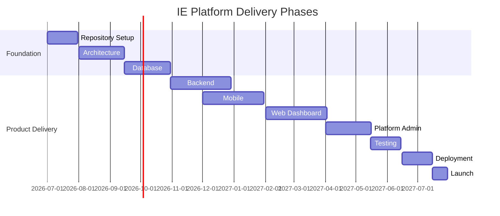

# Project Roadmap

## Revision History

| Version | Date | Author | Summary |
| --- | --- | --- | --- |
| 1.0.0 | 2026-07-04 | Product Management | Initial master roadmap for the IE Platform |

## Table of Contents

1. Phase 0 - Repository Setup
2. Phase 1 - Architecture
3. Phase 2 - Database
4. Phase 3 - Backend
5. Phase 4 - Mobile
6. Phase 5 - Web Dashboard
7. Phase 6 - Platform Admin
8. Phase 7 - Testing
9. Phase 8 - Deployment
10. Phase 9 - Launch
11. Phase 10 - Future Products

## Phase 0 - Repository Setup

### Milestones

- Establish documentation repository structure.
- Define AI engineering standards and templates.
- Enable contribution, review, and publishing workflows.

### Deliverables

- Repository skeleton
- Documentation standards
- Governance and contribution documents

### Dependencies

- Documentation Guild
- Engineering leadership

### Risks

- Inconsistent documentation practices

### Success Criteria

- All standards documents published and linked.

## Phase 1 - Architecture

### Milestones

- Finalize core platform architecture.
- Capture domain boundaries and engine responsibilities.
- Approve ADRs for key design decisions.

### Deliverables

- Architecture reference documents
- ADRs for core platform choices
- Integration and deployment diagrams

### Dependencies

- Solution Architecture
- Security Team

### Risks

- Overly coupled design or premature optimization

### Success Criteria

- Shared architecture reviewed and approved.

## Phase 2 - Database

### Milestones

- Define core schemas for tenant, user, booking, availability, workflow, and audit domains.
- Establish indexing, retention, and migration standards.

### Deliverables

- Database design documents
- ER diagrams
- Migration strategy

### Dependencies

- Data Architecture
- Backend Engineering

### Risks

- Schema drift and missed tenant isolation rules

### Success Criteria

- Core schema design approved and documented.

## Phase 3 - Backend

### Milestones

- Implement core domain services and APIs.
- Build authentication, authorization, and workflow services.
- Create event-driven worker patterns.

### Deliverables

- Backend services
- API layer
- Event processing workers

### Dependencies

- API Platform
- Platform Engineering

### Risks

- Incomplete service boundaries or complexity growth

### Success Criteria

- Core booking and workflow backend capabilities available.

## Phase 4 - Mobile

### Milestones

- Deliver mobile experience foundation for AppointIE.
- Reuse shared domain logic and design patterns.

### Deliverables

- React Native application shell
- Core user journeys
- Mobile API integration layer

### Dependencies

- Mobile Engineering
- Design Systems

### Risks

- Duplicate logic and inconsistent experience

### Success Criteria

- Core booking and management flows available on mobile.

## Phase 5 - Web Dashboard

### Milestones

- Build the web dashboard for users and administrators.
- Implement tenant-aware configuration and management workflows.

### Deliverables

- Web application shell
- Dashboard experiences
- Admin and configuration views

### Dependencies

- Web Engineering
- Product Management

### Risks

- Poor usability or inaccessible interfaces

### Success Criteria

- Core administrative workflows are usable and accessible.

## Phase 6 - Platform Admin

### Milestones

- Deliver platform administration capabilities.
- Support tenant onboarding, configuration, branding, and feature flags.

### Deliverables

- Admin console
- Tenant management workflows
- White-label configuration tooling

### Dependencies

- Product Strategy
- Platform Operations

### Risks

- Inadequate administrative controls or config sprawl

### Success Criteria

- Administrators can manage tenants and platform settings safely.

## Phase 7 - Testing

### Milestones

- Build automated test coverage across domain, API, UI, and integration layers.
- Define release quality gates.

### Deliverables

- Unit, integration, and end-to-end suites
- Quality governance documents

### Dependencies

- Quality Engineering
- Backend and Frontend teams

### Risks

- Weak regression coverage

### Success Criteria

- Release confidence and regression protection established.

## Phase 8 - Deployment

### Milestones

- Establish deployment pipelines, environments, and observability.
- Define rollback and incident readiness processes.

### Deliverables

- CI/CD pipelines
- Observability stack
- Operational runbooks

### Dependencies

- Platform Operations
- Security Team

### Risks

- Poor deployment reliability or weak rollback plans

### Success Criteria

- Production deployment workflow is repeatable and observable.

## Phase 9 - Launch

### Milestones

- Prepare launch readiness artifacts.
- Conduct release validation and customer readiness review.

### Deliverables

- Release notes
- Launch checklist
- Support handoff documentation

### Dependencies

- Product Management
- Operations
- Security

### Risks

- Launch readiness gaps or incomplete support cover

### Success Criteria

- AppointIE launches successfully with documented support and rollout readiness.

## Phase 10 - Future Products

### Milestones

- Identify future product extensions and platform reuse opportunities.
- Evaluate new verticals, AI copilots, and white-label offerings.

### Deliverables

- Future product framework
- Platform extension proposal set
- Innovation backlog

### Dependencies

- Product Strategy
- AI Engineering

### Risks

- Overextension or weak platform reuse

### Success Criteria

- The platform roadmap supports future products without major redesign.

## Glossary

- Milestone: A checkpoint that marks meaningful progress in a phase.
- Deliverable: A concrete output expected from a phase.

## References

- [IE Platform Master Index](IE-PLATFORM-MASTER-INDEX.md)
- [AI System Prompt](AI_SYSTEM_PROMPT.md)
- [AI Coding Standard](AI_CODING_STANDARD.md)
- [AI Architecture Standard](AI_ARCHITECTURE_STANDARD.md)

## Appendix A: Roadmap Governance

The roadmap should be reviewed at least quarterly and updated whenever architecture, product scope, or delivery priorities change.
